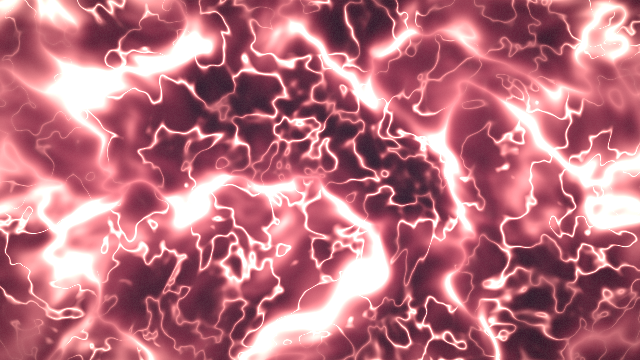
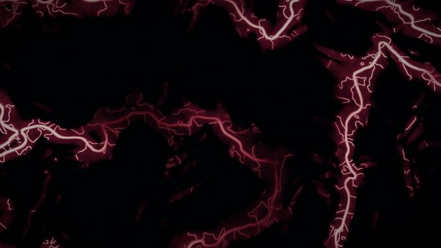

# Análisis del script original

`TouchDesigner_VJ_NONCOMMERCIAL_1280x720_VEINS_V2_STABLE.py`, 1622 líneas.

La base es sólida: bus A/B con crossfade, `allowCooking` para congelar
escenas, Error DAT, panel de diagnóstico, arranque en blackout y un contrato
visual escrito. Eso es más disciplina de la que se ve normalmente. Los
problemas están en otra capa.

---

## 1. Bugs reales

### 1.1 El MIDI secuestra los parámetros

```python
proj.par.Speed.expr = dynamic_midi_expr('Midispeed', 0.5)
```

`Speed`, `Density`, `Hue`, `Chaos` y `Brightness` quedan **atados a una
expresión**. Consecuencia directa: no puedes mover un slider a mano nunca
más — TouchDesigner recalcula la expresión y pisa tu valor en el siguiente
frame. Presets, automatización y el propio dashboard quedan inutilizados.

Y si el MIDI no está conectado, los cinco controles se quedan clavados en la
constante de fallback.

### 1.2 Los CC por defecto no existen en el MiniLab MkII

```python
'Speed': 'ch1cc112', 'Density': 'ch1cc113', 'Hue': 'ch1cc114',
'Chaos': 'ch1cc115', 'Brightness': 'ch1cc116',
```

De la memoria de fábrica del MiniLab MkII, los knobs mandan CC **112, 74, 71,
76, 77, 93, 73, 75, 114, 18, 19, 16, 17, 91, 79, 72** — en ese orden. Los CC
113, 115 y 116 no los emite nadie. Tres de tus cinco knobs no hacían nada.

### 1.3 Los pads salen por canal 10, no por canal 1

```python
'Next': 'ch1n36', 'Prev': 'ch1n37', ...
```

Los pads del MiniLab MkII salen de fábrica por **canal 10**. `ch1n36` nunca
llega. Ningún pad funcionaba.

### 1.4 El Threshold TOP estaba invertido

```python
safe_set(vein_threshold, 'comparator', 'less')
```

`less` deja en blanco donde la entrada es **menor** que el umbral, es decir el
fondo. Sumado a dos thresholds encadenados, el resultado es una máscara
invertida y llena de manchones. Parte de por qué el visual no se veía bien.

### 1.5 `resetControls()` llama a `selectScene(0)` justo después de `abortTransition()`

`abortTransition()` incrementa el token y pone `transitioning = False`;
`selectScene(0)` retorna de inmediato si ya estás en la escena 0. Reset no
resetea nada visual si ya estabas en la escena 0.

---

## 2. El problema de arquitectura

### 2.1 El script se destruye a sí mismo

```python
old = root.op('project1')
if old:
    old.destroy()
```

Cada ejecución borra **todo**: mapeo MIDI, device de audio, device MIDI,
ajustes de escena, y cualquier visual que hubieras hecho a mano.

Eso obliga a que *todo* viva dentro de ese único archivo. Con 20 escenas
integradas como la 0, el archivo llega a ~12.000 líneas y cada cambio de un
visual exige reconstruir el rig entero y volver a configurar los devices.

Es un callejón sin salida, y es exactamente lo contrario de lo que pediste:
poder seguir construyendo escenas de forma incremental.

### 2.2 Un visual como red de TOPs es el formato equivocado

La escena 0 son 13 TOPs: `noise → blur → level → level → threshold → blur →
displace(+noise) → threshold → level → blur → level → composite → resolution`.

Dos costos:

**Costo de GPU.** Cada TOP es un render fullscreen completo con escritura y
lectura de VRAM. Trece TOPs son trece pasadas. Tres de ellos son **Blur** con
`filtersize` animado por audio — un blur con radio variable es de lo más caro
que hay en TD, porque el kernel cambia cada frame.

**Costo de autoría.** Pedirle a una IA "haz venas" y que responda con 13 TOPs
cableados por Python es pedirle que programe a ciegas: no puede ver el
resultado, no puede razonar sobre la forma, y los parámetros de cada TOP son
API de TouchDesigner, no ideas visuales. Por eso lo que salió fue plasma y no
venas.

Un shader es lo contrario: es matemática de la imagen, la IA razona bien
sobre eso, y se puede **compilar y previsualizar sin abrir TouchDesigner**.

---

## 3. Costos de rendimiento, en orden

| # | Costo | Por qué |
|---|---|---|
| 1 | 13 TOPs por visual, 3 de ellos Blur animado | 13 pasadas fullscreen + kernels que se recompilan |
| 2 | 20 thumbnails del dashboard leyendo `out1` a 1280×720 | Cada tile muestrea una textura 720p para pintar 240×135 |
| 3 | `onFrameStart` activo | Callback de Python 60 veces por segundo para hacer un módulo |
| 4 | Un `run()` por frame de transición | 0.45 s a 60 fps = 27 callbacks encolados, más lógica de tokens para cancelarlos |
| 5 | Cadenas de expresiones de 3 saltos | `/project1.Speed` → `sceneN.Speed` → `scene_api.Speed` → parámetro del TOP, por cada control y por cada TOP |
| 6 | `scene_api` duplica los 9 parámetros que ya tenía `sceneN` | Dos copias del mismo dato, ambas con expresión |
| 7 | 5 filtros de audio en estéreo a 44.1 kHz | La mitad del trabajo es evitable pasando a mono primero |

Los puntos 1 y 2 son los que de verdad mueven la aguja. Del 3 al 6 son
limpieza.

---

## 4. Lo que sí estaba bien y se conservó

- Bus A/B con crossfade en vez de un switch duro.
- `allowCooking` para congelar escenas inactivas — **la** decisión correcta
  para 20 escenas.
- El puente con Select TOP entre redes anidadas (el comentario del código
  sobre por qué el cableado directo falla es correcto).
- Master fade y blackout solo en `show_out`, con `program_clean` limpio para
  el monitor.
- Error DAT + panel de estado + arranque en blackout.
- La idea del contrato visual. Aquí se vuelve ejecutable en vez de ser un
  texto que hay que recordar.

---

## 5. Detección de kick

```python
Kick = clamp((Bass - Kickthreshold) * Kickgain)
```

Esto no detecta un golpe, detecta **energía sostenida de graves**. Con un
bajo continuo el "kick" se queda pegado en 1 y deja de disparar nada.

Un transitorio es *energía instantánea por encima de la media reciente*:

```
kick = clamp((bass - media_móvil(bass, ~0.35 s)) * gain)
```

Eso sí sube solo en el golpe. Encima va un Trigger CHOP que da una envolvente
attack/release nativa (`beat`), que es lo que de verdad sirve para flashes.

---

## 6. Comparación del visual de venas

**Antes** — noise + threshold: manchas de plasma, sin estructura vascular.



**Ahora** — conjunto de nivel + ancho constante por `fwidth` + jerarquía
tronco/capilar + máscara de cobertura:



La diferencia técnica está explicada en la cabecera de
[`td/visuals/scene00_veins.frag`](../td/visuals/scene00_veins.frag) y en
[05 — Performance](05_PERFORMANCE.md).
