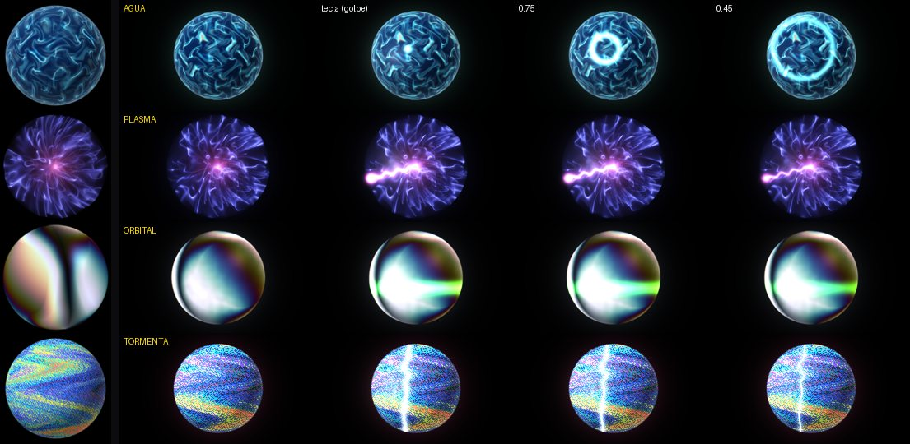
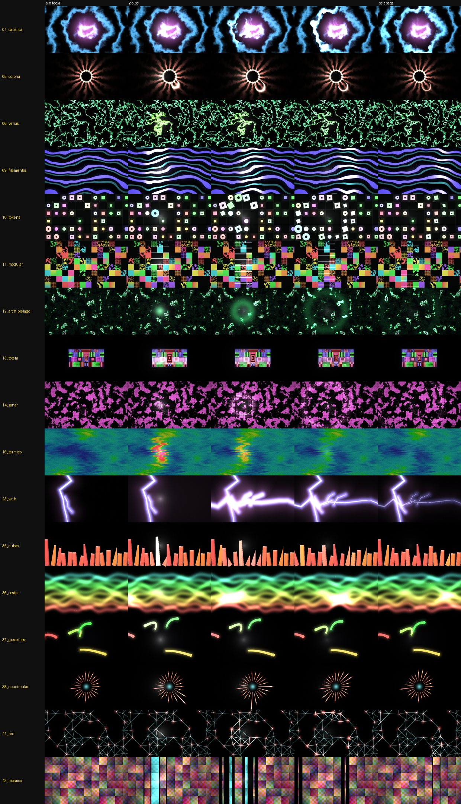

# 🎨 Guía de Visuales — TDAI2026

## 20 Escenas Interactivas Audiovisuales

Este documento describe cada uno de los 20 visuales disponibles, qué hacen y cómo se controlan.

---

## 📑 Índice Rápido

| # | Visual | Tipo | Reactividad |
|---|--------|------|-------------|
| 00 | **Veins** | Orgánico | Bass, Kick, High |
| 01 | **Neural** | Red Geométrica | Bass, Mid, Kick, High |
| 02 | **Ink** | Mancha Fluida | Bass, Mid, High |
| 03 | **Metaball** | Burbujas | Bass, Kick |
| 04 | **Caustics** | Agua Refractada | Bass, Mid, Kick |
| 05 | **Flow** | Campo Vectorial | Bass, Mid, High |
| 06 | **Grid** | Rejilla Dinámica | Bass, Mid, Kick |
| 07 | **Spectrum** | Anillos Concéntricos | Bass, Mid, High, Kick |
| 08 | **Moire** | Interferencia | Bass, Mid, High |
| 09 | **Scanline** | Líneas CRT | Bass, Mid, Kick, High |
| 10 | **Chroma** | Anillos de Color | Bass, Mid, Kick, High |
| 11 | **Lines** | Trazos Fluidos | Bass, Mid, Kick |
| 12 | **Contour** | Curvas de Nivel | Bass, Mid, Kick, High |
| 13 | **Ripple** | Ondas Gaussianas | Bass, Kick |
| 14 | **Orbit** | Órbitas Partículas | Bass, Kick |
| 15 | **Dots** | Puntos Flotantes | Bass, Mid, Kick, High |
| 16 | **Starfield** | Campo de Estrellas | Bass, Mid, Kick, High |
| 17 | **Blocks** | Bloques Dispersos | Bass, Mid, Kick, High |
| 18 | **Tunnel** | Túnel Pulsante | Bass, Mid, Kick, High |
| 19 | **Void** | Vacío Abstracto | Bass, Mid, Kick |

---

## 🎮 Sistema de Control

### 6 Knobs Giratorios (Encoder)

```
┌─ Knob 1: SPEED ─────────────────┐
│  Velocidad global de animación  │
│  Rango: 0.0 – 1.0               │
│  CC: ch1ctrl76                   │
└─────────────────────────────────┘

┌─ Knob 2: DENSITY ───────────────┐
│  Cantidad de detalle/densidad    │
│  Rango: 0.0 – 1.0               │
│  CC: ch1ctrl73                   │
└─────────────────────────────────┘

┌─ Knob 3: HUE ───────────────────┐
│  Paleta de colores              │
│  Rango: 0.0 – 1.0 (HSV wheel)   │
│  CC: ch1ctrl74                   │
└─────────────────────────────────┘

┌─ Knob 4: CHAOS ────────────────┐
│  Turbulencia / distorsión        │
│  Rango: 0.0 – 1.0               │
│  CC: ch1ctrl80                   │
└─────────────────────────────────┘

┌─ Knob 5: BRIGHTNESS ───────────┐
│  Brillo general (Master Fade)    │
│  Rango: 0.0 – 1.0               │
│  CC: ch1ctrl94                   │
└─────────────────────────────────┘

┌─ Knob 6: TRANSITION ──────────┐
│  Duración del fundido             │
│  Rango: 0.05 – 2.0 segundos      │
│  CC: ch1ctrl92                   │
└─────────────────────────────────┘
```

### 5 Pads (Gatillo / Trigger)

- **Pad 1**: Siguiente Escena (→)
- **Pad 2**: Escena Anterior (←)
- **Pad 3**: Blackout On/Off
- **Pad 4**: Guardar Preset (Snapshot)
- **Pad 5**: Reset (Volver a valores por defecto)

### 25 Teclas de Piano (C1-C3)

#### Notas Normales (F1-C3, 41-60)
- Tocar cualquier tecla genera un **anillo de luz** en el visual
- Posición en eje X: nota grave → aguda (izquierda → derecha)
- Intensidad: velocidad de la pulsación
- El anillo persiste mientras sostienes la tecla

#### Efectos Especiales (C1-E1, 36-40)
Notas bajas que aplican efectos globales:

```
┌─ C1 (36): GRAIN ─────────────────┐
│  Añade textura de ruido fino     │
│  Intensidad: controlada por      │
│  velocidad de la tecla           │
└──────────────────────────────────┘

┌─ C#1 (37): GLITCH ────────────────┐
│  Aberración cromática RGB         │
│  RGB shift horizontal             │
│  Efecto: desplazamiento errático  │
└──────────────────────────────────┘

┌─ D1 (38): PIXELATE ───────────────┐
│  Efecto pixelado / blocky         │
│  Tamaño de bloque: según          │
│  velocidad de la tecla            │
└──────────────────────────────────┘

┌─ D#1 (39): STROBE ────────────────┐
│  Destello periódico               │
│  Frecuencia: varía según          │
│  intensidad de pulsación          │
└──────────────────────────────────┘

┌─ E1 (40): INVERT ─────────────────┐
│  Inversión de color (RGB)         │
│  Efecto: negativo fotográfico     │
│  Controlado por velocidad         │
└──────────────────────────────────┘
```

### Audio Reactivity

Cada visual reacciona al audio en tiempo real:

- **Bass (20-180 Hz)**: Brillo de bajos, audioLift
- **Mid (180-2000 Hz)**: Modulación de tinte/hue
- **High (2k-12k Hz)**: Detalles finos, microvibración
- **Kick**: Destello rítmico sincronizado con beat

---

## 📖 Descripción Detallada por Visual

### ESCENA 00: VEINS

**Tipo:** Orgánico, Red Vascular

**Qué es:**
Red de venas luminosas que pulsean como un sistema circulatorio. Los troncos vasculares se ramifican en capilares cada vez más finos. La animación genera flujo pulsante que recorre las ramas.

**Cómo se anima:**
- El resultado es el **conjunto de nivel** de un campo FBM (Fractal Brownian Motion)
- Las venas son los lugares donde el ruido cruza exactamente el valor 0.5
- Domain warp da la sensación de crecimiento orgánico

**Controles:**
- **Speed**: Velocidad del flujo pulsante
- **Density**: Abre/cierra la mascara para ver más o menos red
- **Hue**: Color sangre → cian → violeta
- **Chaos**: Cuánto se retuercen las venas
- **Bass**: Brillo de lo ya claro
- **Kick**: Flash instantáneo
- **Beat**: Empuja los pulsos
- **High**: Vibracion micro de capilares

**Detalles:**
- D1: Tamaño/grosor de venas
- D2: Escala de la jerarquía

**Nota técnica:** Usa líneas de ancho constante en pixeles (usa `fwidth()`) para que el grosor no cambie al acercar/alejar.

---

### ESCENA 01: NEURAL

**Tipo:** Red Geométrica, Voronoi

**Qué es:**
Red de segmentos rectos conectando nodos brillantes. Similar a las venas pero angular y ordenada: es la hermana geométrica de VEINS. Parece una red neuronal o circuito.

**Cómo se anima:**
- Usa **Voronoi diagramas** (técnica F2-F1)
- Cada celda de una rejilla tiene un sitio aleatorio
- Los bordes entre sitios forman segmentos rectos
- Los nodos brillan con intensidad que depende de la distancia

**Controles:**
- **Speed**: Velocidad de pulsos que recorren la red
- **Density**: Cuántas celdas (rejilla más fina)
- **Hue**: Paleta de colores
- **Chaos**: Aleatoriedad de posiciones (rejilla ordenada vs. caótica)
- **Bass**: Brillo
- **Mid**: Tinte adicional
- **Kick**: Flash en nodos
- **High**: Microvibración de sitios

**Detalles:**
- D1: Grosor de segmentos
- D2: Tamaño de nodos

---

### ESCENA 02: INK

**Tipo:** Mancha Fluida, Difusión

**Qué es:**
Una mancha de "tinta" que se expande y fluye como un líquido. Múltiples capas de turbulencia crean remolinos y vórtices. Se anima como si fuera tinta en agua.

**Cómo se anima:**
- Combina capas de fbm con diferentes frecuencias
- Domain warp diferente por capa: cada nivel se va "llevando" al siguiente
- Aspecto muy suave y orgánico

**Controles:**
- **Speed**: Velocidad de expansión
- **Density**: Opacidad de capas
- **Hue**: Color de la mancha
- **Chaos**: Intensidad de turbulencia
- **Bass/Mid/High**: Modulación de brillo/color

---

### ESCENA 03: METABALL

**Tipo:** Blobby, Isosuperficies

**Qué es:**
Burbujas blandas que se fusan entre sí (efecto metaball). Parece como si moléculas se atrajeran formando cuerpos amorfos.

**Cómo se anima:**
- Suma gaussianas alrededor de puntos móviles
- Al sumar, las gaussianas interfieren y crean formas suaves
- La cantidad de puntos ("bolas") es controlable

**Controles:**
- **Speed**: Velocidad de movimiento
- **Density**: Separación entre bolas (más Density = menos separación)
- **Hue**: Color
- **Chaos**: Agitación del movimiento
- **Bass**: Brillo
- **Kick**: Flash

**Detalles:**
- D3: Cantidad de bolas (2-14)

---

### ESCENA 04: CAUSTICS

**Tipo:** Refracción Óptica, Agua

**Qué es:**
Patrón de luz refractada como la que ves en el fondo de una piscina. Patrones irregulares de brillo y sombra que fluyen como agua.

**Cómo se anima:**
- Dos capas de fbm independientes
- Se desplazan a velocidades distintas
- La multiplicación de ambas crea el efecto caótico

**Controles:**
- **Speed**: Velocidad del flujo
- **Density**: Contraste
- **Hue**: Tinte del agua
- **Chaos**: Turbulencia
- **Bass/Mid/Kick**: Modulación de brillo

---

### ESCENA 05: FLOW

**Tipo:** Campo Vectorial, Partículas

**Qué es:**
Líneas de flujo que siguen un campo vectorial invisible. Parece que las líneas "fluyen" como agua en un río invisible.

**Cómo se anima:**
- Cada línea sigue un campo definido por ruido
- Las líneas se desplazan continuamente
- Los colores varían según dirección/magnitud del flujo

---

### ESCENA 06: GRID

**Tipo:** Rejilla Dinámica, Deformación

**Qué es:**
Una rejilla rectangular que se deforma y tuerce como si fuera una malla elástica. Los cuadrados se comprimen y estiran.

**Cómo se anima:**
- Una rejilla base se distorsiona con domain warp
- Domain warp lo mueve cada frame

---

### ESCENA 07: SPECTRUM

**Tipo:** Anillos Concéntricos, Espectro

**Qué es:**
Anillos concéntricos de color que pulsean desde el centro. Como un espectro de audio visualizado en círculos.

**Cómo se anima:**
- Capas de ruido en coordenadas polares
- El ángulo y la distancia crean bandas circulares
- Audio reactivity amplifica el efecto

---

### ESCENA 08: MOIRE

**Tipo:** Patrón de Interferencia, Óptico

**Qué es:**
Patrones de interferencia visual (moiré). Cuando superpones dos rejillas ligeramente rotadas, aparecen nuevos patrones.

**Cómo se anima:**
- Dos rejillas desplazadas en ángulo
- Se rotan independientemente
- La interferencia crea los patrones moiré

---

### ESCENA 09: SCANLINE

**Tipo:** CRT, Digital

**Qué es:**
Líneas horizontales parpadeantes como las de un tubo de rayos catódicos antiguo. Efecto muy digital y nostálgico.

**Cómo se anima:**
- Líneas regulares con variación de brillo
- Audio reactivity hace que parpadeen
- High frequency agrega micro-detalles

---

### ESCENA 10: CHROMA

**Tipo:** Anillos de Color, Separación RGB

**Qué es:**
Anillos concéntricos con separación cromática (RGB split). Cada color está ligeramente desplazado, creando un efecto 3D retro.

**Cómo se anima:**
- Anillos similares a SPECTRUM pero con aberración cromática intencional
- Los tres canales RGB se desplazan ligeramente

---

### ESCENA 11: LINES

**Tipo:** Trazos Fluidos, Vector

**Qué es:**
Líneas sinuosas que fluyen como río. Trazos continuos que se tejen entre sí.

**Cómo se anima:**
- Varias líneas siguen funciones seno/coseno con fases diferentes
- Domain warp agrega movimiento orgánico

---

### ESCENA 12: CONTOUR

**Tipo:** Curvas de Nivel, Topografía

**Qué es:**
Curvas de nivel como un mapa topográfico. Líneas concéntricas que representan altitud.

**Cómo se anima:**
- Líneas de nivel de un campo FBM
- Se desplazan y tuercen con domain warp

---

### ESCENA 13: RIPPLE

**Tipo:** Ondas, Impacto

**Qué es:**
Un pulso gaussiano que se expande como una onda en el agua. Anillos concéntricos suaves que emergen del centro.

**Cómo se anima:**
- Un único pulso gaussiano que decae con el tiempo
- Múltiples "ecos" con delays para crear efecto de ondulación

---

### ESCENA 14: ORBIT

**Tipo:** Partículas, Sistema Solar

**Qué es:**
Pequeñas partículas orbitando alrededor de un centro. Como un sistema planetario miniatura.

**Cómo se anima:**
- Partículas se mueven en órbitas circulares
- Múltiples órbitas con periodos diferentes
- Colisiones ópticas crean destellos

---

### ESCENA 15: DOTS

**Tipo:** Puntos Flotantes, Swarm

**Qué es:**
Un enjambre de puntos luminosos que flotan y se agrupan. Parece una manada de luciérnagas.

**Cómo se anima:**
- Puntos siguen trayectorias de Lissajous o similar
- Audio reactivity hace que se agrapen/dispersen

---

### ESCENA 16: STARFIELD

**Tipo:** Campo de Estrellas, Paralaje

**Qué es:**
Un campo de estrellas con efecto parallax 3D. Tres capas de estrellas a profundidades diferentes. Parece que viajas a través del espacio.

**Cómo se anima:**
- 3 capas de estrellas a profundidades fijas
- Cada capa se mueve más lento cuanto más lejos esté (parallax)
- Las estrellas parpadean (twinkle)

**Controles:**
- **Speed**: Velocidad de deriva
- **Density**: Cantidad de estrellas
- **Hue**: Tinte de estrellas
- **Chaos**: Velocidad del parpadeo
- **Bass**: Brillo
- **Kick**: Flash global
- **High**: Microvibración de posición

**Detalles:**
- D1: Tamaño de estrellas
- D2: Escala de rejilla

---

### ESCENA 17: BLOCKS

**Tipo:** Bloques Dispersos, Dispersión

**Qué es:**
Pequeños cuadrados dispersos que aparecen/desaparecen. Efecto muy limpio y minimalista.

**Cómo se anima:**
- Rejilla de cuadrados
- Cada cuadrado aparece según un threshold que varia con el tiempo

**Controles:**
- **Speed**: Velocidad de aparición
- **Density**: Cantidad de bloques visibles
- **Hue**: Color
- **Chaos**: Aleatoriedad
- **Bass/Mid/High**: Modulación

---

### ESCENA 18: TUNNEL

**Tipo:** Túnel Pulsante, Profundidad

**Qué es:**
Un túnel que se expande y contrae como si estuvieras entrando/saliendo. Efecto muy inmersivo.

**Cómo se anima:**
- Patrón que se repite radialmente
- Pulsación con el audio

---

### ESCENA 19: VOID

**Tipo:** Abstracto, Vacío

**Qué es:**
Un visual muy minimalista y abstracto. Pocas formas, mucho espacio. Efecto meditativo.

**Cómo se anima:**
- Formas simples que se desplazan lentamente

---

## 🎹 Cómo Usar el Piano

### Tocar Normalmente
1. Presiona cualquier tecla de F1 a C3
2. Aparece un anillo de luz que marca tu posición en la pantalla
3. La **posición** del anillo (izquierda-derecha) depende de cuál tecla tocas
4. La **intensidad** del anillo depende de la **velocidad** (fuerza) con que toqués
5. Cada tecla es un golpe: se dispara al tocar y se apaga solo (~0.35 s)

### Qué hace el piano en cada visual

Además del anillo, **cada visual tiene su propio complemento** de teclado.
En todos: la **tecla** (grave → agudo) elige *dónde* pasa, y la **fuerza**
elige *cuánto* (más alcance, más tamaño, más brillo).

| # | Visual | Qué hace la tecla |
|---|---|---|
| 00 | biolluvia | Cae una gota invitada, más grande y brillante, en su columna |
| 01 | cáustica | **Piedra en la pileta**: un anillo de onda dobla la trama de luz y la enciende a su paso |
| 02 | mediaecho | Golpe de zoom: una copia extra muy metida hacia el centro |
| 03 | mediaglitch | Onda de choque de agua que deforma la imagen |
| 04 | radar | El brazo salta al ángulo de la tecla + aparece un contacto nuevo |
| 05 | corona | **Protuberancia**: un arco de plasma sale del borde del sol (el teclado da la vuelta al sol) |
| 06 | venas | **Hinchazón**: las venas cerca del punto se engrosan y viran a tono caliente |
| 07 | kaleido | Rota el mandala a un ángulo propio y le suma espejos |
| 08 | halftone | Gira la trama de impresión y agranda los puntos |
| 09 | filamentos | **Cuenta de luz** que corre por las hebras + la hebra acompañante se desdobla |
| 10 | tokens | **Salto de fichas**: un anillo recorre el tablero; cada ficha que toca salta, gira y cambia de color |
| 11 | modular | **Zapping**: la columna de pantallitas cambia de canal, con barra de refresco CRT |
| 12 | archipiélago | **Marejada**: una ola circular inunda la costa a su paso |
| 13 | tótem | **Negativo**: la franja horizontal de la tecla invierte su patrón y el ojo se abre |
| 14 | sonar | **Pulso activo**: un frente de sonar revela la grilla y hace aparecer ecos |
| 15 | cultivo | Aparece una colonia invitada que se fusiona con las demás |
| 16 | térmico | **Cuerpo caliente**: una silueta tibia entra en cámara y se enfría |
| 17 | veins | Una vena nueva y gruesa atraviesa la pantalla |
| 18 | neural | Una neurona (y sus vecinas) se enciende entera |
| 19 | ink | Cae una gota de tinta que se fusiona con la mancha |
| 20 | metaball | Entra una bola invitada que empuja a las demás |
| 21 | caustics | Salpicadura que deforma todo el patrón |
| 22 | flow | Onda de choque que aparta las corrientes + corriente nueva |
| 23 | web | **Arco**: un arco eléctrico horizontal cruza la pantalla a la altura de la tecla |
| 24 | aurora | Viento que aparta las cortinas + cortina nueva |
| 25 | lines | Pulsada de guitarra: un bump viaja por todas las líneas |
| 26 | contour | Se levanta un pico nuevo en el mapa de curvas de nivel |
| 27 | ripple | Nace una fuente de onda extra con sus ecos |
| 28 | orbit | Un cometa cruza y sacude las órbitas |
| 29 | dots | Estrella fugaz que activa los puntos a su paso |
| 30 | crackedglass | Impacto extra que agrieta el vidrio |
| 31 | bokeh | Ráfaga de viento que empuja y agranda las luces |
| 32 | nebula | Explosión (nova) que dispersa la nube |
| 33 | tormenta | Cae un rayo extra (vertical) en la X de la tecla |
| 34 | ferrofluido | Un dedo toca el líquido y levanta un pico |
| 35 | cubos | **Dominó**: la barra de la tecla salta y una ola inclina a las demás hacia los lados |
| 36 | costas | **Nudo**: las líneas se pellizcan hacia la altura de la tecla mientras un nudo cruza la pantalla |
| 37 | gusanitos | **Susto**: los gusanos cerca del golpe dan un respingo y se iluminan |
| 38 | ecucircular | **Ola que gira**: el estirón da la vuelta al círculo barra por barra |
| 39 | láseres | Aparece un haz extra en el ángulo de la tecla |
| 40 | anillosneon | Nace un anillo de acento del color de la tecla |
| 41 | red | **Mensaje**: la luz viaja por los cables y nodos de la red, no por el aire |
| 42 | imgfuego | Aparece una copia grande y brillante de la imagen |
| 43 | mosaico | **Volteo**: las baldosas dan media vuelta como cartas y muestran el reverso |
| 44 | persianas | Una lama se abre del todo un instante |
| 45 | orbe agua | **Gota**: cae una gota sobre la esfera y abre un anillo de luz en las cáusticas |
| 46 | orbe plasma | **Tocar el vidrio**: un filamento salta del núcleo al borde, hacia la tecla (el teclado da la vuelta al globo) |
| 47 | orbe orbital | **Salto de nivel**: una banda de color cruza el orbe a la altura de la tecla |
| 48 | orbe tormenta | **Rayo**: cae un relámpago sobre la esfera en la X de la tecla |
| 55 | franjas de eco | Aparece un anillo de luz en la posición de la tecla |
| 56 | baldosas reordenadas | Aparece un anillo de luz en la posición de la tecla |
| 57 | espiral de trazos | Aparece un anillo de luz en la posición de la tecla |
| 58 | tinta fluida | Aparece un anillo de luz en la posición de la tecla |
| 59 | nebulosa de partículas | Aparece un anillo de luz en la posición de la tecla |
| 60 | aura flow | Aparece un anillo de luz en la posición de la tecla |
| 61 | frequency modulation | Aparece un anillo de luz en la posición de la tecla |
| 62 | the first pulse | Aparece un anillo de luz en la posición de la tecla |
| 63 | mantra network | Aparece un anillo de luz en la posición de la tecla |
| 64 | spectral veil | Aparece un anillo de luz en la posición de la tecla |
| 65 | wave eno | Aparece un anillo de luz en la posición de la tecla |
| 66 | lucifer study | Aparece un anillo de luz en la posición de la tecla |
| 67 | x-ray vision | Aparece un anillo de luz en la posición de la tecla |
| 68 | geometric fractals | Aparece un anillo de luz en la posición de la tecla |

En **negrita**, los que se rediseñaron para que no se repitan entre visuales.
Las escenas 45–48 son orbes adaptados de Orbkit (MIT, ver
`td/visuals/LICENSE_ORBKIT.md`): a la izquierda el original, después el
adaptado sin tecla y en tres momentos del piano.





### Usar Efectos Especiales
1. Toca las teclas bajas C1 a E1
2. Cada una aplica un efecto distinto al visual
3. La **intensidad** del efecto depende de qué tan fuerte toque
4. El efecto dura 1-2 frames y luego decae

**Ejemplo:** Toca C1 fuerte para un grain muy notable, suave para algo sutil.

---

## ⚡ Tips de Performance

- **Si baja el FPS:** Reduce Density o usa Brightness más bajo
- **Grain/Glitch desactivados:** No aparecen en E1-C3, eso no se usa
- **Está choppy:** Reduce Chaos, baja resolución de salida
- **Muy claro:** Usa Brightness como master fade para todo

---

## 📱 Conversión: HTML → PDF

El documento se genera en ambos formatos:
- **PDF**: `docs/TDAI2026_Visuales.pdf` (imprimible, profesional)
- **HTML**: `docs/TDAI2026_Visuales.html` (editable, interactivo en navegador)

Para imprimir HTML a PDF:
```bash
# En navegador: Imprimir → Guardar como PDF
# O desde línea de comandos:
wkhtmltopdf TDAI2026_Visuales.html TDAI2026_Visuales.pdf
```

---

## 📚 Ver También

- `docs/02_MIDI_MINILAB_MKII.md` — Mapeo MIDI completo
- `docs/03_VISUAL_SPEC.md` — Especificación visual (para devs)
- `docs/06_PRIMERA_PRUEBA.md` — Primeros pasos al encender

---

**Última actualización:** Septiembre 2026  
**Sistema:** TDAI2026 Visuales  
**Generado desde:** `/td/visuals/scene*.frag`
