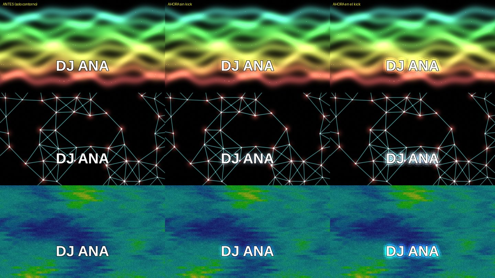

# 09 — Overlay de texto (nombres de artista)

Un nombre de artista, tipeado a mano en el momento, sobre cualquiera de las
36 escenas — con contorno automático para que se lea encima de cualquier
fondo, y un fundido suave al mostrarlo/ocultarlo.

**A propósito no es una lista precargada.** El pedido fue explícito: *"quiero
yo setear los textos con la compu en vivo"* — así que `Textcontent` es un
campo de texto libre, no un setlist. Lo que sí se separó en dos pasos
distintos es **escribir** y **mostrar**.

---

## Cómo se usa

### Antes del show: la cola de nombres

`/project1` → pestaña **Texto** → **Cola de nombres** → escribe los
artistas de la noche separados con `;`:

```
DJ Ana; Nico B2B Sol; Ñandú; Cierre: Colectivo Faro
```

Acentos, ñ y espacios funcionan: es un campo de texto normal.

### En el show: un solo pad

**Pad 5 del banco A (TEXTO)** o el botón **MOSTRAR/OCULTAR** del dashboard:

- Si el texto está oculto, **muestra el siguiente nombre de la cola** (con
  fundido) y la cola avanza.
- Si está en pantalla, lo oculta. Ocultar no avanza la cola.
- Al llegar al final, vuelve al primero.

Botones del dashboard, debajo del panel de Master FX:

| Botón | Qué hace |
|---|---|
| **ESCRIBIR/LISTO** | Pausa los atajos del teclado de la compu mientras escribes (ver abajo) |
| **< ANTERIOR** / **SIGUIENTE >** | Con el texto en pantalla, cambia al nombre anterior/siguiente con fundido. Oculto, solo deja listo cuál sale |
| **MOSTRAR/OCULTAR** | Lo mismo que el pad TEXTO |

El panel de estado muestra `>> TEXTO  EN PANTALLA: "…"   sigue: "…"`.

### Un nombre que no estaba en la cola

Escríbelo en **Texto (se tipea en vivo)** y dale MOSTRAR: **lo último que
escribiste a mano gana** sobre la cola, esa vez. La próxima, la cola sigue
donde estaba.

### Escribir sin disparar atajos

Los atajos del teclado de la compu (`0`–`9` saltan de escena, `espacio`
hace blackout) siguen activos aunque estés escribiendo en un campo de
TouchDesigner: tipear "DJ 2" saltaba a la escena 2. Por eso:

1. Pulsa **ESCRIBIR/LISTO** en el dashboard. El status dice
   `>> ESCRIBIENDO  atajos de teclado en pausa`.
2. Escribe tranquilo.
3. Al **mostrar** el texto, los atajos vuelven solos. O pulsa
   ESCRIBIR/LISTO otra vez.

## El texto es parte del visual

Además del contorno negro (que garantiza que se lea), las letras tienen un
**halo del color del visual que tienen detrás** — el shader promedia la
imagen alrededor del texto — y el halo **crece con cada kick**. Sobre fondo
casi negro, el halo es un blanco frío tenue. Solo cuesta mientras el texto
está visible.



## Banco de fuentes

`Font` elige el estilo tipográfico de una lista (`config.FONTS`); `Fontnext`
(aprendible) la va rotando sin tocar el mouse. Agregar una fuente nueva es
sumar un nombre a esa lista — si el sistema no la tiene instalada, el Text
TOP cae a una genérica sola, no rompe nada.

## Tamaño y posición

Dos perillas en la misma página:

- **Tamaño** — de un título chico a uno de pantalla completa.
- **Posición vertical** (0 abajo, 1 arriba) — por defecto cerca del tercio
  inferior, para no taparle el centro al visual.

## Por qué se lee sobre cualquier escena

El texto sale **blanco con contorno negro** (más el halo de color, ver arriba), siempre — no es una perilla de
color. El contorno se calcula en el mismo shader que compone el texto sobre
el programa (no es un efecto nativo del Text TOP): sin él, un texto blanco
se pierde por completo contra las escenas más claras del set. Verificado
renderizando el shader contra un fondo oscuro y uno claro — se lee igual en
los dos.

## Dónde va en la cadena de video

El overlay se compone **después del bloom** (para que el texto salga nítido,
sin el glow difuminándolo) y **antes del master fade** — así el blackout y
el master brightness lo tapan a él también: si el show se va a negro, el
texto se va con el show.

## Dónde está cada cosa en el código

| | |
|---|---|
| El banco de fuentes | `td/vjcore/config.py` → `FONTS` |
| Cuánto tarda el fundido | `td/vjcore/config.py` → `TEXT_FADE_SECONDS` |
| Los parámetros (página Texto) | `td/vjcore/builder.py` |
| Mostrar/ocultar, cola, anterior/siguiente, ciclar fuente | `td/vjcore/dats/control_script.py` → `toggleTextVisible`, `textNext`, `textPrev`, `toggleTextEditing`, `nextFont` |
| Pausa de atajos mientras escribes | `td/vjcore/keyboard.py` y `dats/keyboard_logic.py` (`Textediting`) |
| Botones del dashboard | `td/vjcore/dashboard.py` (fila de TEXTO) |
| El Text TOP + fundido nativo + composite | `td/vjcore/program.py` → `_build_text_overlay` |
| El shader de contorno/relleno | `td/vjcore/program.py` → `_TEXT_FRAG` |
| Tests offline | `python3 td/tools/test_text_overlay.py` y `test_texto_cola.py` |
