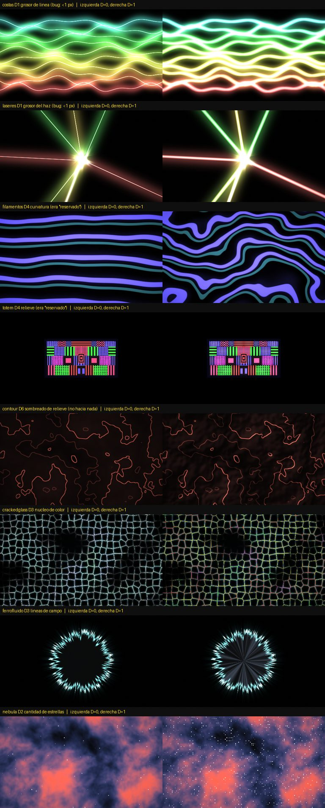

# 11 — Auditoría de las perillas Detail (D1–D6)

Cada escena tiene 6 perillas de detalle, cuya función muestra la leyenda del
dashboard. La pregunta: **¿cada una cambia algo visible de verdad?** Son 45
escenas × 6 = **270 perillas**.

## Cómo se midió

1. **Estático**: cada `uD1…uD6` que el código usa tiene su `@D` documentado, y
   al revés. Encontró 3 perillas documentadas como "reservado" que no hacían
   nada: filamentos D4 y D5, tótem D4.
2. **Render**: cada escena se renderizó en el navegador (los mismos shaders,
   WebGL) con cada perilla en 0 y en 1, en cuatro condiciones (reposo, audio
   fuerte con kick y piano, y otros dos momentos de la animación). Se mide qué
   parte **de lo dibujado** cambia.
3. Las dudosas se miraron **a ojo**, lado a lado: las estrellas, los nodos y
   los rayos son elementos finos, y los porcentajes los subestiman.

## Resultado

| | Antes | Después |
|---|---|---|
| Muertas (no cambian nada visible) | **14** | 0 |
| Flojas (casi no se notan) | **7** | 0 (web D6 queda sutil a propósito) |

### Bugs reales

- **costas D1 y láseres D1** (grosor de línea): `edgeLine()` mide el ancho **en
  píxeles** y recibía valores de 0.003–0.026, es decir, menos de un píxel.
  La perilla no hacía nada y la línea la dibujaba solo el glow. El haz extra
  del piano en láseres tenía el mismo error.
- **filamentos D4/D5, tótem D4**: estaban "reservados". Ahora son la curvatura
  de las hebras, el color de la hebra acompañante y el relieve de las celdas.
  El test `test_detail_knobs.py` **ya no acepta "reservado"**.
- **contour D6**: la "oclusión ambiental" no producía nada visible. Ahora es
  **sombreado de relieve** (el terreno iluminado de costado).
- **crackedglass D3/D6**: el borde de la grieta se saturaba a blanco y ni el
  núcleo de color ni la variación de tono se veían. El núcleo ahora reemplaza el
  color, y D6 también sube la saturación.
- **ferrofluido D3**: las líneas de campo se multiplicaban por el color del
  líquido, casi negro. Ahora suman un brillo propio.
- **nebulosa D2/D4/D6**: las estrellas se perdían contra la nube; ahora
  tienen más brillo. **tormenta D6**: la nube tenía un brillo de ~9/255 y
  moverla no se notaba.

También se reforzaron los rangos de glitch D2, corona D6, radar D1, ripple D6,
gusanitos D4, mosaico D1 y persianas D2.

**De paso:** la leyenda del dashboard mostraba la primera línea de cada `@D`
cortada en un "(casi" colgando. Ahora se corta antes del paréntesis abierto.

## Tabla completa

Porcentaje de lo dibujado que cambia entre la perilla en 0 y en 1 (el máximo
de las cuatro condiciones), medido a 640×360. `*` = arreglada en esta
auditoría. Los valores bajos que quedan son elementos finos verificados a
ojo (estrellas, nodos, rayos) o perillas de **velocidad**, que en una imagen
quieta no se ven y en movimiento sí.

| Escena | D1 | D2 | D3 | D4 | D5 | D6 |
|---|---|---|---|---|---|---|
| 00_biolluvia | 43% | 94% | 104% | 62% | 95% | 90% |
| 01_caustica | 79% | 68% | 57% | 87% | 29% | 97% |
| 02_mediaecho | 45% | 53% | 53% | 51% | 15% | 93% |
| 03_mediaglitch | 20% | 10% * | 100% | 20% | 4% | 11% |
| 04_radar | 2% * | 96% | 36% | 8% | 77% | 27% |
| 05_corona | 14% | 76% | 61% | 76% | 50% | 9% * |
| 06_venas | 96% | 90% | 48% | 95% | 17% | 97% |
| 07_kaleido | 79% | 89% | 6% | 99% | 66% | 99% |
| 08_halftone | 86% | 60% | 100% | 41% | 73% | 100% |
| 09_filamentos | 78% | 84% | 50% | 85% * | 26% * | 103% |
| 10_tokens | 50% | 12% | 69% | 30% | 9% | 5% |
| 11_modular | 51% | 70% | 93% | 28% | 22% | 96% |
| 12_archipielago | 98% | 92% | 22% | 23% | 5% | 24% |
| 13_totem | 72% | 68% | 45% | 27% * | 14% | 61% |
| 14_sonar | 96% | 66% | 14% | 13% | 74% | 93% |
| 15_cultivo | 77% | 46% | 26% | 19% | 23% | 100% |
| 16_termico | 58% | 69% | 58% | 68% | 100% | 100% |
| 17_veins | 98% | 84% | 54% | 90% | 30% | 52% |
| 18_neural | 40% | 98% | 52% | 75% | 8% | 8% |
| 19_ink | 83% | 64% | 21% | 100% | 23% | 31% |
| 20_metaball | 51% | 93% | 84% | 95% | 73% | 36% |
| 21_caustics | 96% | 99% | 86% | 100% | 55% | 34% |
| 22_flow | 94% | 101% | 47% | 20% | 16% | 87% |
| 23_web | 9% | 101% | 72% | 37% | 102% | 5% |
| 24_aurora | 98% | 102% | 63% | 68% | 94% | 19% |
| 25_lines | 94% | 102% | 47% | 21% | 10% | 9% |
| 26_contour | 36% | 39% | 28% | 102% | 23% | 52% * |
| 27_ripple | 102% | 100% | 72% | 97% | 88% | 34% * |
| 28_orbit | 59% | 24% | 82% | 26% | 57% | 87% |
| 29_dots | 97% | 56% | 83% | 99% | 79% | 23% |
| 30_crackedglass | 12% | 102% | 16% * | 99% | 42% | 15% * |
| 31_bokeh | 102% | 86% | 87% | 58% | 86% | 84% |
| 32_nebula | 99% | 2% * | 86% | 2% * | 61% | 1% * |
| 33_tormenta | 1% | 11% | 2% | 6% | 98% | 10% * |
| 34_ferrofluido | 54% | 66% | 64% * | 40% | 63% | ✓ ojo * |
| 35_cubos | 9% | 92% | 92% | 42% | 63% | 31% |
| 36_costas | 42% * | 91% | 86% | 99% | 95% | 99% |
| 37_gusanitos | 25% | 60% | 17% | 17% * | 90% | 84% |
| 38_ecucircular | 56% | 85% | 100% | 72% | 32% | 58% |
| 39_laseres | 15% * | 95% | 86% | 97% | 16% | 62% |
| 40_anillosneon | 51% | 76% | 66% | 75% | 81% | 94% |
| 41_red | 9% | 57% | 52% | 99% | 50% | 86% |
| 42_imgfuego | 99% | 14% | 90% | 98% | 72% | 99% |
| 43_mosaico | 20% * | 13% | 95% | 100% | 54% | 100% |
| 44_persianas | 89% | 22% * | 85% | 86% | 24% | 88% |

## Cómo repetirla

Los scripts de render viven fuera del repo (usan el Chromium del entorno).
La parte estática la cubre `python3 td/tools/test_detail_knobs.py`.
