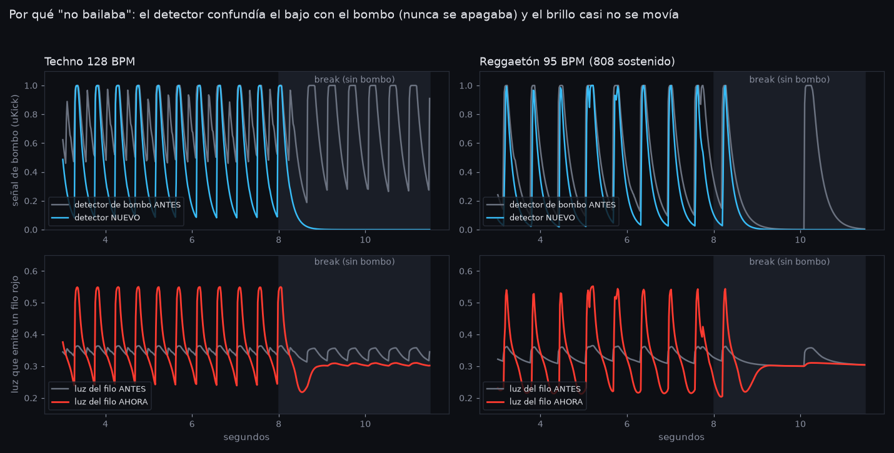

# Por qué los visuales no "bailaban" (y qué se cambió)



Medido con una simulación de la cadena de audio del rig
(`td/tools/sim_baile/`, techno 128 BPM y reggaetón 95 BPM con 808 sostenido),
no a ojo.

## Las dos causas

1. **El detector de bombo nunca se apagaba.** Restaba los graves menos su
   media y multiplicaba por 9. La línea de bajo vive en la misma banda que el
   bombo (< 180 Hz), así que también disparaba: 25 falsos en 6 s de techno, y
   `uKick` nunca bajaba de ~0.46. Si el "bombo" está siempre prendido, nada
   pulsa. Afectaba a las 54 escenas, al beat del autopilot y a la luz BEAT
   del dashboard.
2. **Aunque detectara bien, el brillo casi no se movía.** Todo el audio solo
   *subía* el brillo en el golpe, pero los visuales ya están cerca de su tope y
   el tonemap se comía la diferencia: un filo rojo sobre negro oscilaba **×1.09**.
   El ojo necesita ×2 o más para leer "se prende y se apaga".

Por eso subir coeficientes escena por escena no cambiaba nada.

## Qué se cambió

| | Antes | Ahora |
|---|---|---|
| Detector | bajo − media, ×9 | **compuerta**: solo cuenta lo que llega al 65% del pico reciente de graves (`Kickgate`), ×6 |
| Falsos (techno, 6 s) | 25 | **0** (13/13 aciertos) |
| Caída del flash | 0.22 s | 0.15 s (más contraste entre golpes) |
| Oscilación del filo rojo | ×1.09 techno · ×1.18 reggaetón | **×2.5 techno · ×2.8 reggaetón** |

**Pump** (en `program.py`, etapa de bloom, costo ~0): la imagen entera baja
entre golpes (45%) y pega arriba en el bombo (+60%), como el sidechain de un
DJ. Se aplica después de todas las escenas, así que funciona igual en las 54.

- **Perilla 6 (Audio)** = cuánto bombea. En 0 no bombea nunca.
- Sin bombo (break, entre temas, sin micrófono) se apaga solo y la imagen
  vuelve a su brillo normal en menos de 1 s (canal nuevo `groove`).
- Si el bajo igual dispara el bombo en algún tema: **Audio → Compuerta del
  bombo**, subila (0.7–0.8). Si hay bombos que no detecta, bajala (0.55).

## Para verlo

`git pull` y correr `td/RUN_ME.py` dentro de TouchDesigner (el rebuild). Sin
el rebuild TD sigue con la red vieja.

## Volver a medir

```
pip install numpy scipy matplotlib
cd td/tools/sim_baile
python3 sim_kick.py    # compara detectores
python3 sim_final.py   # luz en pantalla antes / ahora
python3 plot.py        # regenera docs/img/baile_antes_despues.png
```

## Sin música no reacciona nada (compuerta de música)

El auto-gain lleva cada banda a su pico reciente. Con música es lo que
queremos; sin música **amplifica el ruido de la sala**. Medido
(`td/tools/sim_baile/sim_silencio.py`): una sala con gente y sin música
(−32 dBFS) llegaba a nivel 0.89, medios 0.78, agudos 0.79. Casi lo mismo que
un tema, así que los visuales bailaban con el murmullo.

Ahora hay una **compuerta** que mira el nivel crudo, antes del auto-gain.
Debajo del umbral, todas las señales de audio valen 0: escenas, pump,
autopilot, luz BEAT y colores de pads.

- Se abre si el sonido se **sostiene** ~0.4 s. Un aplauso o una voz suelta no
  la abren. Se cierra ~1.5 s después de que la música para, así que un corte
  corto dentro del tema no la cierra.
- **Audio → Calibrar compuerta**: apretarlo **en silencio** (sala abierta, sin
  música). Mide la sala y deja el umbral 8 dB arriba. Con eso, en la
  simulación todo queda en 0 sin música y abre en 0.4 s cuando entra el tema.
- Default −26 dB, por si no se calibra.
- Cuando está cerrada, el panel de status dice **">> SIN MUSICA"**, para
  que no parezca que el audio se rompió.
