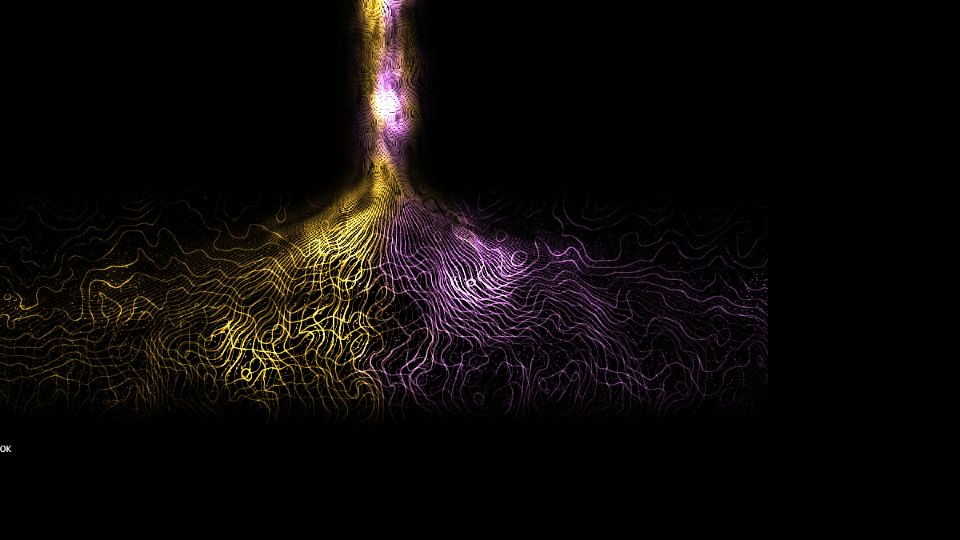

# Escena 60: Aura Flow

Referencia: [*TD Drop #34 — Aura Flow*, de Pao Olea](https://www.youtube.com/watch?v=qBBll7HmCqc). La captura compartida por el usuario muestra una columna cálida que desciende y se abre en trazos dorados y violetas sobre negro. Esta imagen define la composición y los colores.

| Tutorial | Escena 60 |
|---|---|
| Point Generator sobre Torus | Tallo central y apertura lateral definidos por un campo de flujo |
| Noise, Twist y Trail SOP | Dos familias de filamentos curvos con turbulencia animada |
| Atributos de color y Lookup | Oro y violeta distribuidos por posición y ruido |
| Segunda geometría de puntos | Chispas dispersas de tamaño fino |
| PBR, blur y bloom | Filamentos luminosos y bloom compartido del rig |

La vista previa se renderizó en WebGL a 960×540 con las perillas a mitad de recorrido, **sin el bloom final de TouchDesigner**. Es una reconstrucción de la apariencia del video, no una copia de su red SOP ni una simulación de 5000 partículas.

El shader usa una sola pasada GLSL. `Detail 1–6` ajustan el grosor del tallo, el alcance lateral, la densidad, la turbulencia, el reparto de violeta y el brillo. El kick acentúa localmente los trazos. Speed mueve los campos de flujo mientras avanza el reloj musical compartido; con audio en pausa el reloj se congela y el dibujo queda quieto. No hay zoom global.

La compilación y la vista previa están verificadas. El acabado con bloom y los FPS reales se deben comprobar en el equipo de show.
