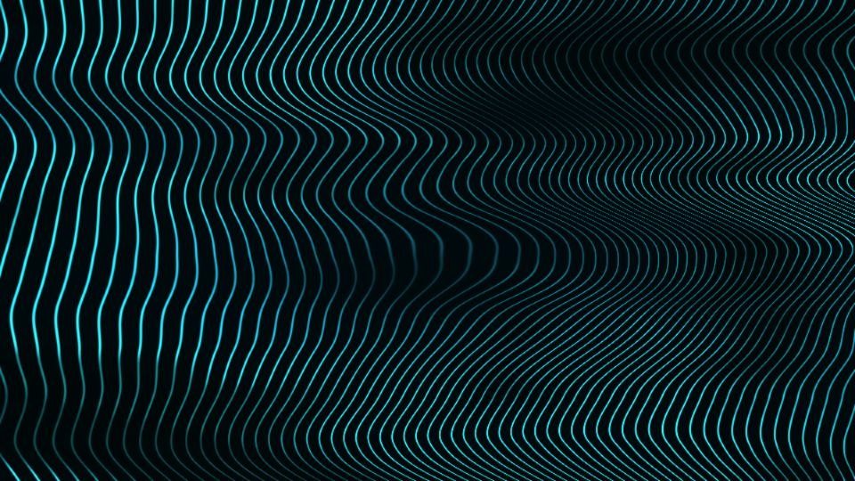

# Escena 61: Frequency Modulation

Referencia: [*Frequency Modulation | TouchDesigner Tutorial*, de ARCXIDIA](https://www.youtube.com/watch?v=CXRVWrM4HyY). El video usa TOPs y un mapa acumulado calculado con el método Hillis-Steele para desplazar líneas de barrido. La captura proporcionada por el usuario define el aspecto buscado: líneas turquesa finas que se doblan, se comprimen hacia la derecha y atraviesan vacíos oscuros sobre un fondo azul profundo.

| Tutorial | Escena 61 |
|---|---|
| Scanlines | Bandas verticales de fase continua |
| Mapa acumulado y desplazamiento | Suma de pliegues amplios, ondulación fina y un pliegue local |
| Modulación de frecuencia | Aumento gradual de la densidad de líneas hacia la derecha |
| Composición y transformación | Campo de luz cian con zonas oscuras y fondo azul profundo |

La vista previa se renderizó en WebGL a 960×540 con las perillas a mitad de recorrido, **sin el bloom final de TouchDesigner**. La escena aproxima el resultado visual del tutorial; no reproduce su cadena exacta de TOPs ni el algoritmo Hillis-Steele.

Una sola pasada GLSL calcula las líneas y su desplazamiento. `Detail 1–6` ajustan cantidad, amplitud de pliegues, ondulación fina, zonas oscuras, variación de color y brillo. El kick deforma localmente los trazos, sin zoom global. Speed mueve el campo mientras avanza el reloj musical compartido; con audio en pausa, el dibujo queda quieto.

La compilación y la vista previa están verificadas. El acabado y los FPS reales deben comprobarse en TouchDesigner.
