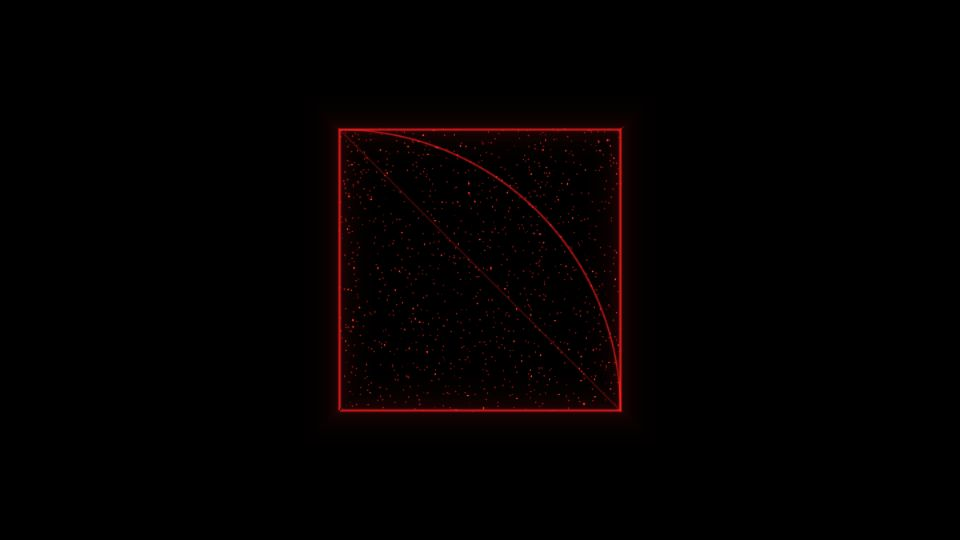
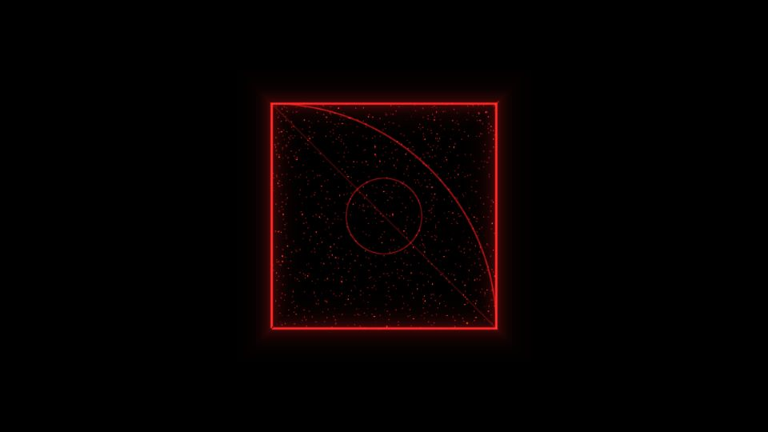

# Escena 62: The First Pulse

Referencia de aspecto: [*The first pulse | Touchdesigner project*, de filippo_odorico](https://www.youtube.com/watch?v=u_ZhBUkBLXg). El fotograma muestra un cuadrado rojo luminoso sobre negro, con partículas dentro, una diagonal fina y un arco que cruza el cuadro. El video es una pieza terminada, no un tutorial de construcción.

Las vistas previas se renderizaron en WebGL a 960×540 con las perillas a mitad de recorrido, **sin el bloom final de TouchDesigner**. La segunda simula un golpe fuerte de `kick/beat`; no es una captura del rig con música real.

La escena usa una sola pasada GLSL para el marco, las dos curvas, las chispas y la onda del golpe. `Detail 1–6` ajustan tamaño, cantidad de partículas, grosor, fuerza de las curvas, halo y brillo. Speed anima únicamente las partículas cuando avanza el reloj musical compartido. Con audio en pausa, el reloj se congela: el cuadro permanece quieto y no hay respiración de zoom.

La compilación y ambas vistas previas están verificadas. El acabado con bloom y los FPS reales deben comprobarse en TouchDesigner.
