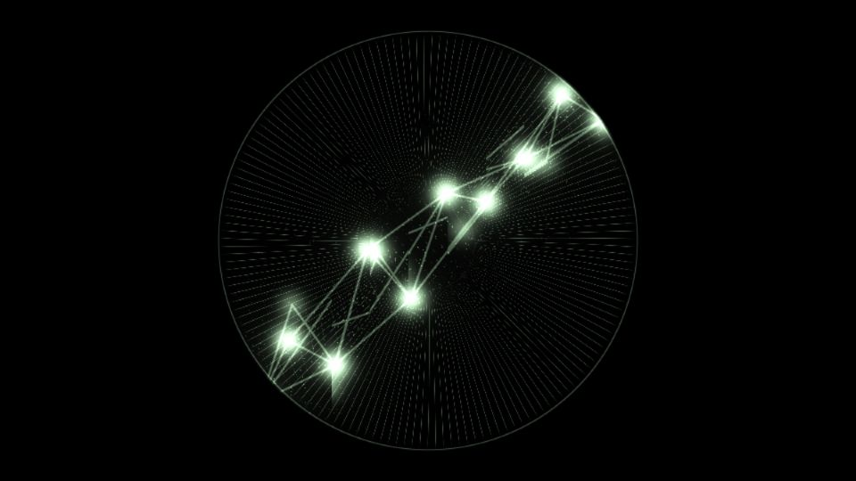

# Escena 63: Mantra Network

Referencia de aspecto: [*TN40 Mantra (MCX) | TouchDesigner Audio Visual Noodle*, de Alaghast](https://www.youtube.com/watch?v=m3JVkRG1xSs). La captura proporcionada por el usuario muestra un gran disco de hilos radiales y una red diagonal de nodos y conexiones blancas verdosas sobre negro. El autor indica que usó operadores C++ MCX propios y procesó el visual con los mismos datos de su sintetizador.

La vista previa se renderizó en WebGL a 960×540 con las perillas a mitad de recorrido, **sin el bloom final de TouchDesigner**. Es una reconstrucción de la composición visible, no del sintetizador ni de los operadores MCX del video.

El shader usa una sola pasada GLSL. Calcula los hilos y el borde del disco de forma analítica; para la red evalúa solo los nodos cercanos a cada píxel. `Detail 1–6` ajustan radio, chispas, densidad de filamentos, curvatura, conexiones y brillo. El kick destaca los nodos y Speed mueve ligeramente la red mientras avanza el reloj musical compartido. Con audio en pausa, el reloj queda quieto y no hay zoom global.

La compilación y la vista previa están verificadas. El bloom y los FPS reales deben comprobarse en el equipo de show.
