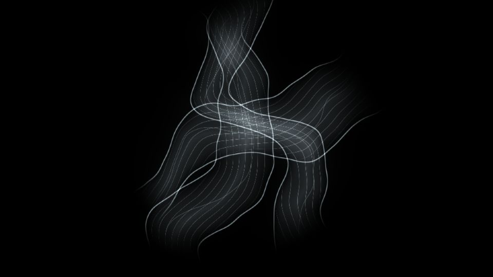

# Escena 64: Spectral Veil

Referencia de aspecto: [*First Steps with TouchDesigner. Sound: Waldorf Iridium Mk2*, de Sascha Neudeck](https://www.youtube.com/watch?v=YD53eo5znuU). El video muestra velos blancos translúcidos que se doblan y cruzan lentamente sobre negro. Es una referencia de apariencia; la escena reproduce los pliegues luminosos con una técnica más ligera.

La vista previa se renderizó en WebGL a 960×540 con las perillas a mitad de recorrido, **sin el bloom final de TouchDesigner**. No es una captura del rig en ejecución.

El shader usa una sola pasada GLSL, tres capas analíticas y un campo de ruido de dos octavas compartido. No hay partículas, feedback, raymarching ni textura adicional. `Detail 1–6` controlan anchura, brillo de bordes, hebras finas, turbulencia, tinte y brillo general. Speed mueve los pliegues cuando avanza el reloj musical compartido; con audio en pausa, la imagen queda quieta. El kick aumenta un poco la luz local sin ampliar el cuadro.

La compilación y la vista previa están verificadas. Los FPS reales y el acabado con bloom deben comprobarse en TouchDesigner y en el equipo de show.
