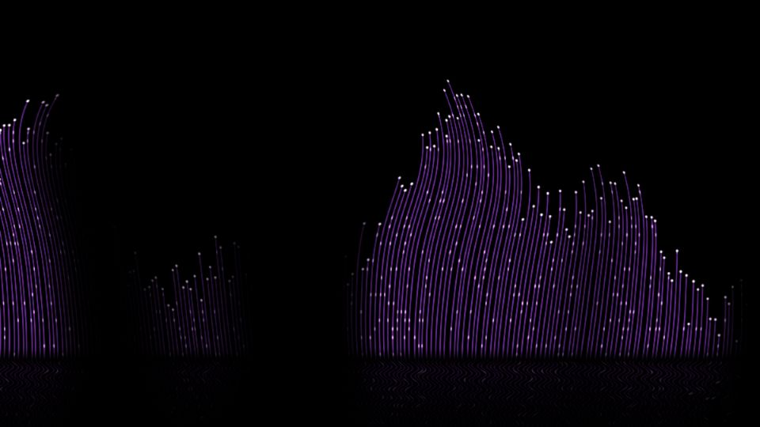

# Escena 65: Wave Eno

Referencia de aspecto: [*Wave Eno*, de Mr Paolo](https://www.youtube.com/watch?v=lDSLWmBagqA). El autor presenta un modelo de ondas de BluesQing con música de Brian Eno. La captura proporcionada por el usuario muestra grupos de hebras violetas con puntas blancas, mucho negro entre ellos y un reflejo tenue en la parte inferior.

La vista previa se renderizó en WebGL a 960×540 con las perillas a mitad de recorrido, **sin el bloom final de TouchDesigner**. Es una reconstrucción visual, no una copia del modelo original.

Una sola pasada GLSL calcula la ola y consulta una fibra por píxel. El reflejo se calcula en el mismo shader por simetría y se desvanece hacia abajo. No hay SOPs, sistema de partículas, feedback ni un segundo pase de reflejo. `Detail 1–6` ajustan cantidad de fibras, curvatura, longitud, complejidad de las olas, reflejo y brillo. Los golpes destacan las puntas; Speed cambia la ola mientras avanza el reloj musical compartido. Con audio en pausa, la imagen queda quieta y no hay zoom global.

La compilación y la vista previa están verificadas. Los FPS reales deben comprobarse en TouchDesigner y en el equipo de show.
