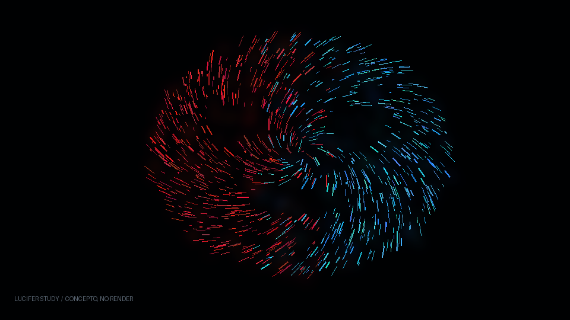

# Escena 66: Lucifer Study

Referencia: [*Lucifer | TouchDesigner Study_09*, de mc2](https://www.youtube.com/watch?v=XXRD9NAN654). El video presenta una forma orgánica fragmentada con zonas rojas y cian sobre negro. Según la descripción del autor, su proyecto parte de un video hecho con Google Flow, mapas de altura, normal y alfa, análisis de audio, feedback y un efecto que resalta las partes brillantes.

Esta escena recrea esa dirección visual con un shader procedimental de una pasada. Dibuja una máscara irregular, placas luminosas, grietas oscuras y un trazo cian inferior. Es una **interpretación**, porque no se dispone del video fuente ni del `.toe` original. No reproduce sus mapas ni su feedback.

La imagen es una **miniatura conceptual**, hecha para identificar la escena en el manual. No representa una captura de TouchDesigner.

`Detail 1–6` controlan tamaño de la máscara, cantidad de fragmentos, profundidad de grietas, longitud de esquirlas, mezcla rojo/cian y brillo. Speed mueve lentamente el material cuando avanza el reloj musical compartido; el kick ilumina partes de la textura. Con audio en pausa, el reloj se detiene y no hay zoom automático.

El shader pasó la validación GLSL. No se obtuvo una vista previa visual fiable en el navegador local; el aspecto final y los FPS deben comprobarse en TouchDesigner antes del show.
