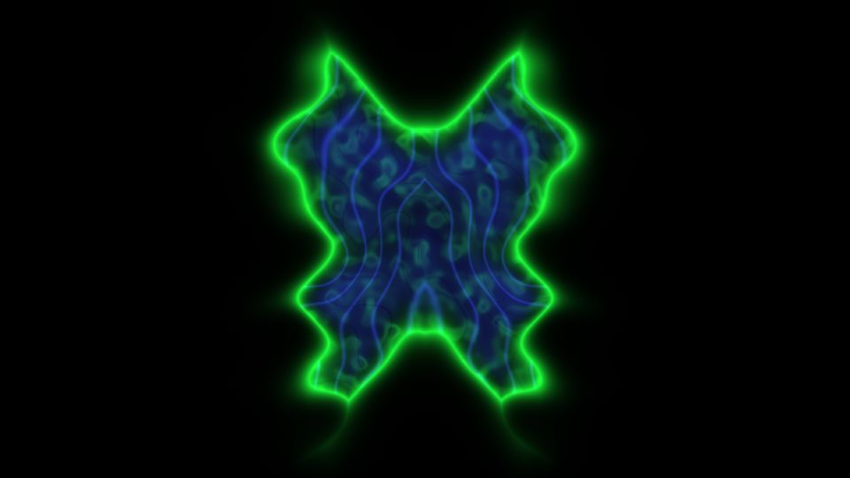

# Escena 67: X-Ray Vision

Referencia: [*X-Ray vision*, de PiFrac-DEV unfiltered](https://www.youtube.com/watch?v=HJp-4ypmSAY). En el video se ven formas orgánicas que cambian de configuración, con un borde verde neón, estructuras azules en el interior y mucho fondo negro. La descripción menciona partículas, ruido procedural, feedback y reacción al sonido.

La escena propone una interpretación ligera con un shader de una pasada. Una silueta bilateral irregular contiene líneas que parecen estratos y pequeños fragmentos luminosos. Los detalles cambian de forma con el reloj musical compartido; cuando la música se detiene, queda quieta. No hay zoom automático ni lectura de media externa.

La imagen es una vista previa WebGL a 960×540 con las perillas a mitad de recorrido. Usa las mismas funciones de ruido y color del rig, sin el postproceso final de TouchDesigner.

`Detail 1–6` controlan anchura de lóbulos, cantidad de líneas, definición del borde, irregularidad, mezcla verde/azul e intensidad de la luz. Density aumenta la complejidad de las líneas, Chaos deforma el borde y el kick acentúa su brillo.

El `.toe` original no forma parte de esta reconstrucción. La compilación GLSL y la vista previa están verificadas; los FPS reales requieren una prueba en TouchDesigner.
