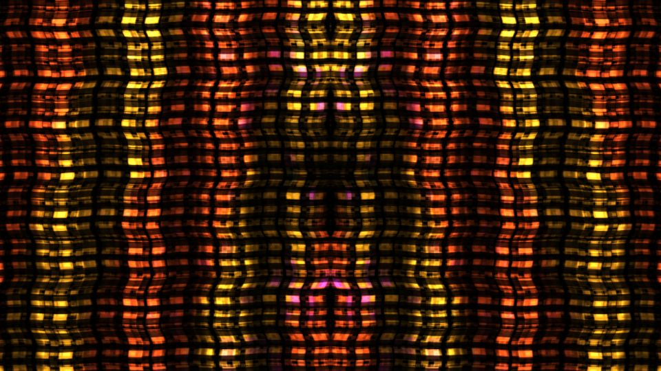

# Escena 68: Geometric Fractals

Referencia: [*Geometric Fractals*, tutorial de PPPANIK](https://www.youtube.com/watch?v=8-lD2MTsfLA). Su resultado muestra columnas y franjas densas de color ámbar sobre negro, con pequeñas zonas cian y violetas. El tutorial construye el patrón mediante mosaico, transformaciones, ruido y un bucle de feedback.

Esta escena aproxima esa composición con tres escalas de celdas geométricas calculadas en una sola pasada GLSL. Evita el buffer de historial y las múltiples pasadas del feedback original. Por eso mantiene el carácter visual, pero no reproduce exactamente la evolución del proyecto del autor.

La vista previa se renderizó en WebGL a 960×540 con las perillas a mitad de recorrido, sin el postproceso final de TouchDesigner.

`Detail 1–6` ajustan anchura de columnas, franjas horizontales, presencia de escalas, distorsión, acentos fríos y brillo. Speed gobierna un desplazamiento local suave; el kick refuerza la luz. Todo usa el reloj musical compartido, así que la imagen queda quieta cuando el audio se pausa, sin zoom automático.

La compilación y el aspecto pueden revisarse en WebGL. Los FPS reales se deben comprobar en TouchDesigner.
