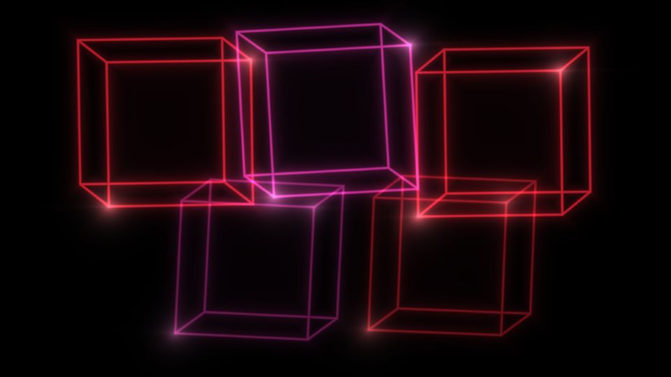

# Escena 69: Audio Prisms

Referencia: [*How to make audio prisms in TouchDesigner*, de Noah Shipman](https://www.youtube.com/watch?v=tZt1SQUZl6U). La introducción muestra prismas de caras oscuras y aristas rojas o violetas, con destellos en las esquinas. El tutorial los construye mediante instancing, análisis de audio, varias cámaras, composición y feedback.

Esta escena dibuja cinco prismas analíticos en una pasada GLSL. Las aristas, la profundidad aparente y los destellos recuerdan el resultado visible, pero no reconstruyen la red de cámaras ni el feedback del proyecto original. No requiere geometría SOP ni media externa.

La imagen es una vista previa WebGL a 960×540 con las perillas a mitad de recorrido y sin el postproceso final de TouchDesigner.

`Detail 1–6` controla tamaño, visibilidad de prismas secundarios, profundidad, grosor de aristas, mezcla rojo/violeta y brillo de esquinas. Density ajusta ligeramente el tamaño del conjunto, Chaos varía las orientaciones y el kick ilumina aristas y vértices. Speed gobierna giros locales suaves mediante el reloj musical compartido; al pausar el audio queda quieta, sin zoom automático.

La compilación y la vista previa WebGL están verificadas. Los FPS reales se deben comprobar en TouchDesigner.
