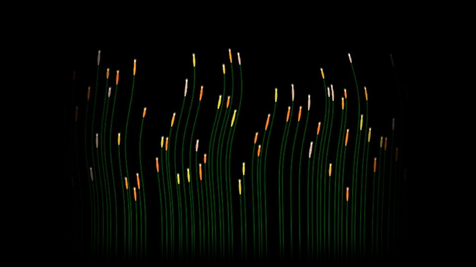

# Escena 70: Plant Trails

Referencia: [*Creando Plantas*, tutorial de Pao Olea](https://www.youtube.com/watch?v=Bbc1iiXc2_o). El resultado final muestra un grupo de tallos delgados verdes con brotes naranjas y algunos tonos violetas o blancos, sobre negro. El tutorial usa POPs, atributos, ruido y trails para generar y animar esas líneas.

Esta escena reconstruye el aspecto con fibras analíticas en una sola pasada GLSL. No usa POPs, partículas ni un buffer de historial; los tallos y brotes se evalúan directamente en cada píxel. Por eso su crecimiento y sus estelas no son una copia de la red original.

La captura se renderizó en WebGL a 960×540 con las perillas a mitad de recorrido, sin el postproceso final de TouchDesigner.

`Detail 1–6` controla cantidad de tallos, curvatura, alturas, longitud de brotes, variedad de color y brillo. Density también aumenta la cantidad. Speed mueve suavemente los tallos con el reloj musical compartido; el kick ilumina los brotes. Sin música, la imagen queda quieta y no hay zoom automático.

La compilación y la vista previa WebGL están verificadas. Los FPS reales se deben comprobar en TouchDesigner.
