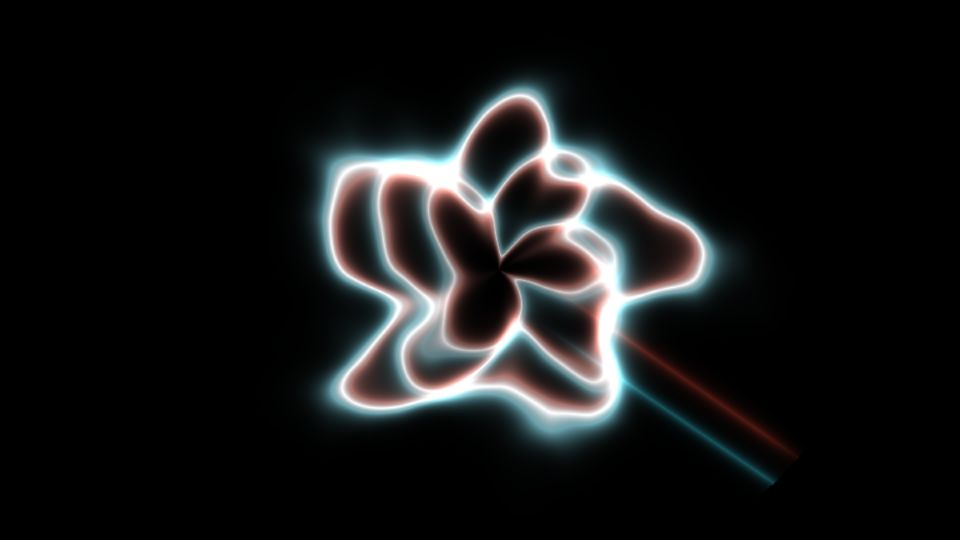

# Escena 71: Color Ribbon

Referencia: [*Color Ribbon Effect*, tutorial de Visual Systems](https://www.youtube.com/watch?v=LaXM51XhpJM). El resultado muestra un nudo de cintas muy brillantes, centro casi blanco, bordes cian y cálidos y una cola diagonal sobre negro. El tutorial combina un sistema de partículas con ruido y color cromático en postprocesamiento.

Esta escena aproxima esa composición con tres cintas deformadas y dos rayos cortos en una pasada GLSL. No simula partículas ni copia el postproceso del proyecto original. El centro blanco aparece donde se cruzan las cintas; los bordes mantienen colores separados.

La vista previa se renderizó en WebGL a 960×540 con las perillas a mitad de recorrido, sin el postproceso final de TouchDesigner.

`Detail 1–6` ajusta separación, pliegues, cruces, anchura, separación cromática e intensidad blanca. Density altera el detalle de los pliegues, Chaos su irregularidad y el kick ilumina el centro. Speed gobierna el movimiento local a través del reloj musical compartido. Sin música, la imagen se queda quieta y no hay zoom automático.

La compilación y la vista previa WebGL están verificadas. Los FPS reales se deben comprobar en TouchDesigner.
