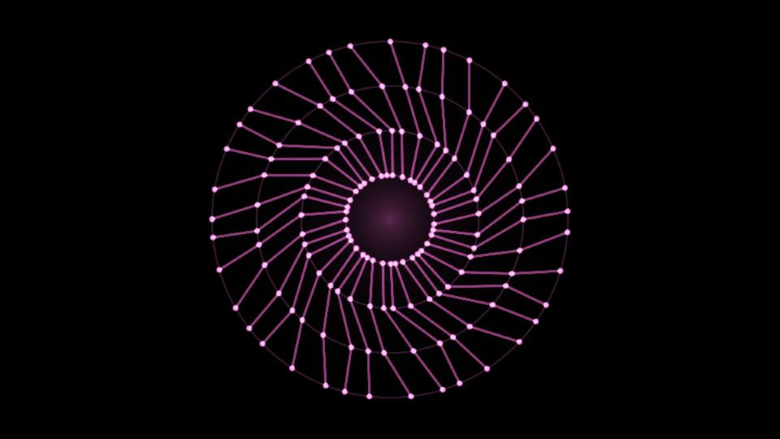

# Escena 72: Audio Orbit

Referencia: [*Audio Reactive Visual in TouchDesigner*, tutorial 200 de The Interactive & Immersive HQ](https://www.youtube.com/watch?v=kcHhg9JXE90). Al final se ve una red circular rosa: nodos luminosos en varios anillos, unidos por líneas que cruzan hacia el centro.

Esta adaptación dibuja cuatro anillos y sus enlaces directamente en una pasada GLSL. No reproduce la red de operadores ni la geometría exacta del tutorial. La cantidad de nodos está acotada y no hay simulación, feedback ni desenfoque adicional.

La vista previa se renderizó en WebGL a 960×540 con las perillas a mitad de recorrido, sin el postproceso final de TouchDesigner.

`Detail 1–6` controla separación, cantidad de nodos, curvatura, grosor de línea, tamaño de puntos y centro. `Speed` regula la rotación; `Density` suma nodos; `Chaos` altera los enlaces. El kick expande ligeramente cada anillo y aumenta su brillo. Todo el movimiento usa el reloj musical compartido `uTime`, que se detiene cuando no hay audio: no hay zoom automático.

La compilación y la vista previa WebGL están verificadas. Los FPS reales se deben comprobar en TouchDesigner.
