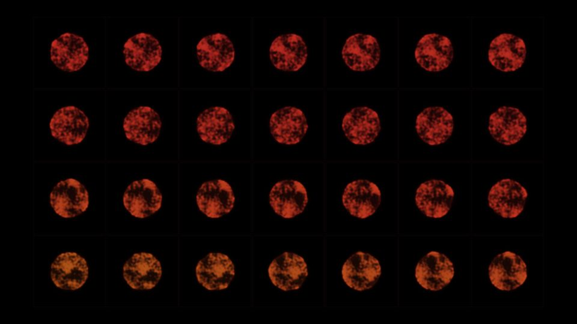

# Escena 73: Time Grid Circles

Referencia: [*Time Grids*, tutorial 71 de bileam tschepe](https://www.youtube.com/watch?v=NK59-7UW7PA&t=1524s), en el capítulo «Example 4: Noise Circles». La idea del tutorial es mostrar una animación en varias celdas, cada una desplazada en el tiempo. En el tramo indicado aparecen círculos de ruido rojizos sobre una cuadrícula negra.

Esta adaptación calcula una fase distinta por celda dentro de un único shader. No almacena cuadros anteriores ni reconstruye la red de operadores del tutorial; la textura de cada círculo se genera con tres muestras de ruido.

La vista previa se renderizó en WebGL a 960×540 con las perillas a mitad de recorrido, sin el postproceso final de TouchDesigner.

`Detail 1–6` controla columnas, filas, separación temporal, irregularidad, tamaño de los círculos y visibilidad de los marcos. `Speed` mueve la textura en cada celda; `Density` y `Chaos` cambian el ruido. El kick ilumina los círculos sin cambiar el tamaño de toda la imagen. La fase usa `uTime`, el reloj musical que se detiene cuando no hay audio.

La compilación y la vista previa WebGL están verificadas. Los FPS reales se deben comprobar en TouchDesigner.
