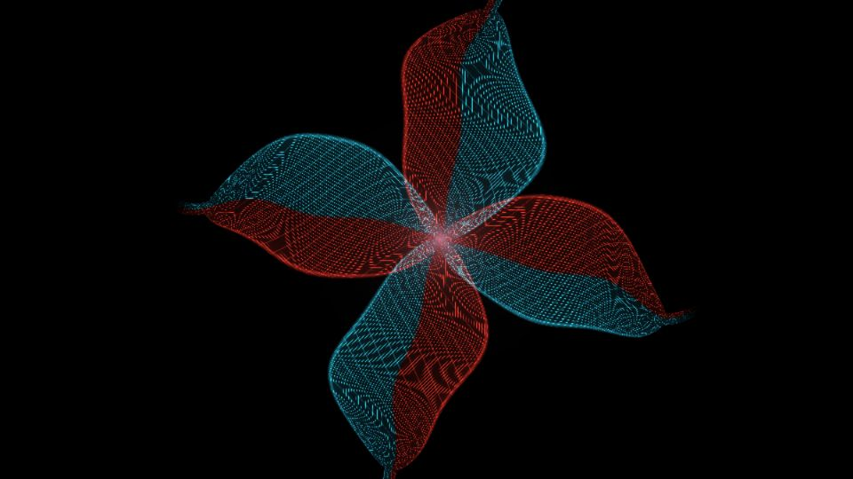

# Escena 74: Instanced Bloom

Referencia: [*Geometry instancing network*, tutorial de Doctor Octopus](https://www.youtube.com/watch?v=yEdPYpYjRSM). El resultado final presenta una figura de superficies plegadas y puntiagudas sobre negro, construida con muchas líneas finas rojas y cian y un halo magenta en el centro.

Esta escena dibuja varias superficies curvas y sus dos familias de líneas directamente en un shader. Es una aproximación bidimensional del aspecto del video: no reproduce su geometría 3D, su cámara ni la red de instancing de TouchDesigner. Evita simulación y desenfoque por escena.

La vista previa se renderizó en WebGL a 960×540 con las perillas a mitad de recorrido, sin el postproceso final de TouchDesigner.

`Detail 1–6` controla apertura, cantidad de superficies, torsión, densidad de la malla, separación de color y brillo del núcleo. `Speed` mueve lentamente los pliegues y la orientación; `Density` suma líneas; el kick ilumina el centro. Todo el movimiento usa `uTime`, que se detiene cuando no hay audio. No hay zoom global.

La compilación y la vista previa WebGL están verificadas. Los FPS reales se deben comprobar en TouchDesigner.
