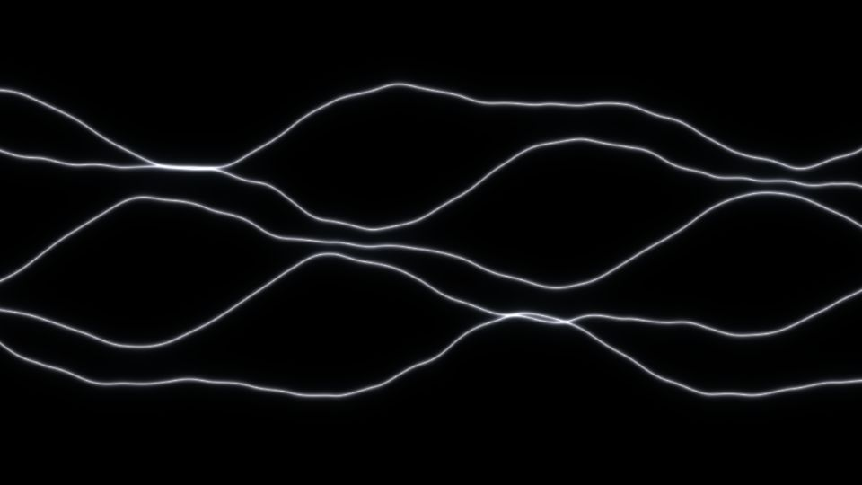
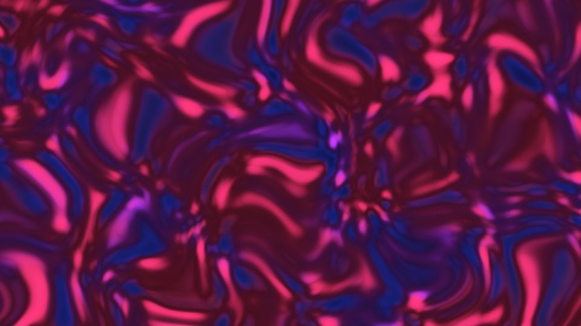
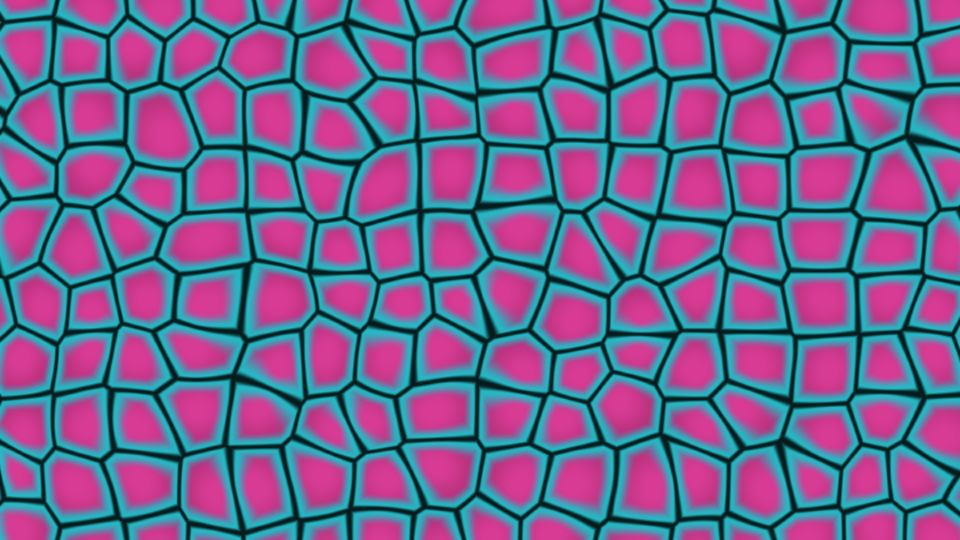
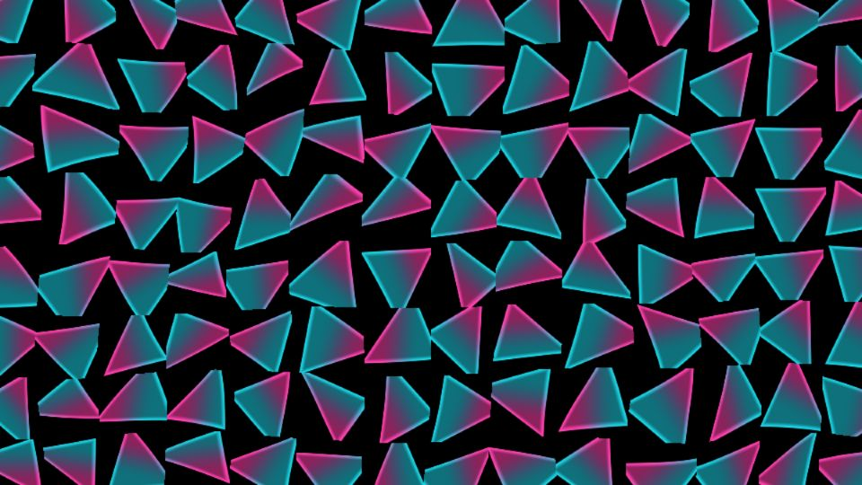

# Escenas 75–78: Deeper Into Noise

Referencia: [*Deeper Into Noise*, tutorial 30 de bileam tschepe](https://www.youtube.com/watch?v=PIoq2BFtMAc). El video presenta cuatro proyectos. Cada uno tiene una escena independiente en el rig:

| Escena | Capítulo | Adaptación |
|---|---|---|
| 75, Noise Lines | [1:40 — Lines](https://www.youtube.com/watch?v=PIoq2BFtMAc&t=100s) | Filamentos blancos curvos y luminosos sobre negro. |
| 76, Noise Landscape | [4:09 — Landscape](https://www.youtube.com/watch?v=PIoq2BFtMAc&t=249s) | Parches cristalinos azules, violetas y rojos con fracturas oscuras. |
| 77, Noise Cellular | [12:34 — Cellular](https://www.youtube.com/watch?v=PIoq2BFtMAc&t=754s) | Células rosas con bordes azulados y hendiduras oscuras. |
| 78, Noise Vaporwave | [19:05 — Vaporwave](https://www.youtube.com/watch?v=PIoq2BFtMAc&t=1145s) | Triángulos afilados de color rosa y cian sobre negro. |

| Lines | Landscape |
|---|---|
|  |  |

| Cellular | Vaporwave |
|---|---|
|  |  |

Las cuatro escenas son aproximaciones visuales en una pasada GLSL. No reconstruyen los operadores ni los parámetros exactos de los proyectos del tutorial. `Detail 1–6` tiene una función específica en cada escena y el dashboard la muestra al seleccionarla. `Speed` gobierna el movimiento local; `Density` y `Chaos` ajustan la complejidad. Todo el movimiento depende de `uTime`, que se detiene cuando no hay audio. No hay zoom global.

Las vistas previas se renderizaron en WebGL a 960×540 con las perillas a mitad de recorrido, sin el postproceso final de TouchDesigner. Los FPS reales se deben comprobar en TouchDesigner.
