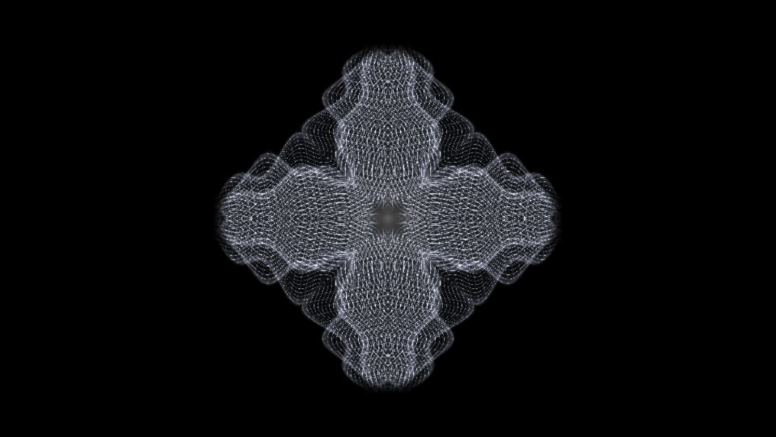

# Escena 79: Psychedelic Mirror

Referencia: [*Audio-reactive psychedelic visuals*, tutorial de Acrylicode](https://www.youtube.com/watch?v=Mt2hwb5cngA&t=7s). El resultado final muestra pliegues blancos finos sobre negro, reflejados en cuatro direcciones hasta formar una figura simétrica y translúcida.

Esta escena aproxima la silueta con tres velos de filamentos y líneas cruzadas por brazo. El shader refleja la forma en cuatro sectores y la calcula en una sola pasada. No reconstruye los tubos, el instancing ni la red de operadores del tutorial.

La vista previa se renderizó en WebGL a 960×540 con las perillas a mitad de recorrido, sin el postproceso final de TouchDesigner.

`Detail 1–6` controla alcance, anchura, filamentos, densidad del velo, contornos y núcleo. `Speed` mueve lentamente los pliegues; `Density` suma textura y el kick ilumina el centro. Todo movimiento usa `uTime`, que se detiene cuando no hay audio; no hay zoom global.

La compilación y la vista previa WebGL están verificadas. Los FPS reales se deben comprobar en TouchDesigner.
