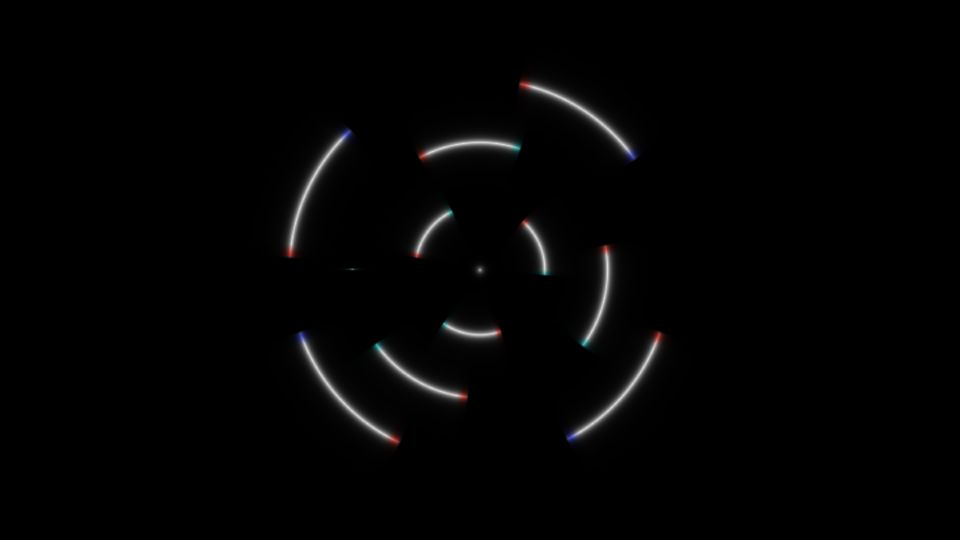

# Escena 80: Polar Trails

Referencia: [*Polar Coordinates in TouchDesigner*, tutorial de Andrew Sun](https://www.youtube.com/watch?v=7DkCTJ8qlPI). El efecto principal muestra arcos blancos incompletos sobre negro, con pequeños extremos rojos, cian y azules. El proyecto usa coordenadas polares, POPs para las trayectorias y postproceso con aberración cromática.

Esta adaptación calcula tres anillos y sus huecos directamente en un shader, sin POPs ni textura de historial. Los extremos cromáticos se colorean en la misma pasada. La composición y el movimiento están inspirados en el video; las trayectorias no reproducen exactamente su red de operadores.

La vista previa se renderizó en WebGL a 960×540 con las perillas a mitad de recorrido, sin el postproceso final de TouchDesigner.

`Detail 1–6` controla separación, cantidad de arcos, huecos, grosor, extremos de color y halo. `Speed` mueve los arcos; `Density` suma segmentos y el kick aumenta su brillo. Todo movimiento usa `uTime`, que se detiene cuando no hay audio. No hay zoom global.

Para mantener 81 escenas visibles en 1920×1080, el dashboard usa 11 columnas y ocho filas. Las miniaturas miden 103×78 píxeles, conservando el espacio para su etiqueta.

La compilación y la vista previa WebGL están verificadas. Los FPS reales se deben comprobar en TouchDesigner.
