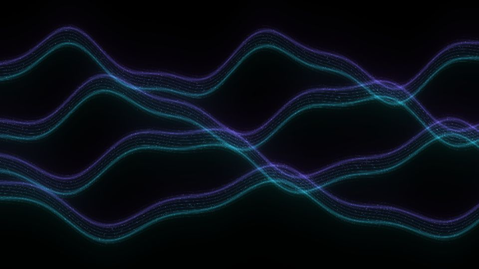

# Escena 81: Wavy Particles

Referencia: [*Wavy Particle Systems in TouchDesigner using POPs*](https://www.youtube.com/watch?v=CZe_pBAyreU), de The Interactive & Immersive HQ. El tutorial termina con cintas onduladas de partículas, bordes cian y violeta y halo sobre fondo negro.

Esta adaptación dibuja cuatro cintas y sus filamentos en una sola pasada GLSL. Usa patrones analíticos en lugar de POPs, miles de puntos o feedback. Conserva la forma y el color de la referencia, pero no reproduce exactamente su red de operadores ni la simulación de partículas.

Vista previa WebGL a 960×540 con las perillas a mitad de recorrido. `Detail 1–6` controla amplitud, ancho, cantidad de filamentos, separación, mezcla de color y halo. `Speed` mueve las ondas; `Density` suma líneas y el kick ilumina los trazos. El movimiento usa `uTime`, que se detiene en silencio. No hay zoom automático.

Las 82 escenas caben en el dashboard de 1920×1080 con 11 columnas y ocho filas. La compilación GLSL y la vista previa WebGL están verificadas; los FPS reales deben medirse en TouchDesigner.
