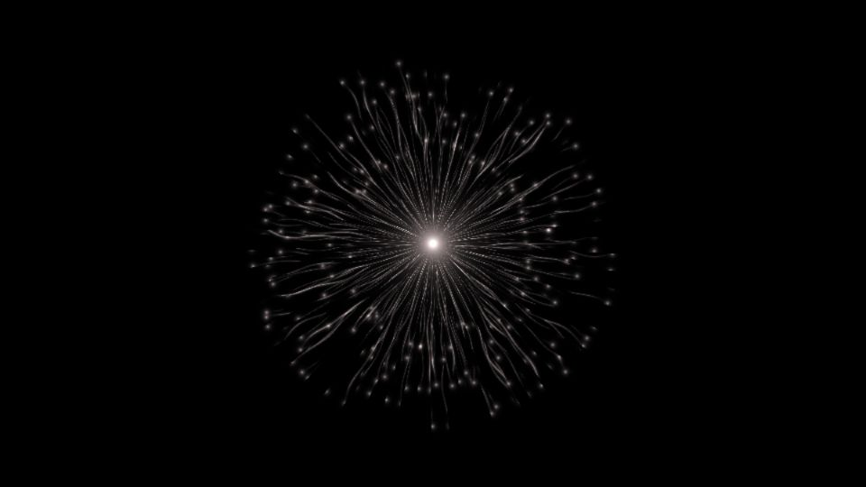

# Escena 82: Iterative Tentacles

Referencia: [*Iterative Tentacles — TouchDesigner POPs tutorial*](https://www.youtube.com/watch?v=k8SnB1mZpII), de Dan Tapper. El resultado muestra una red radial de tentáculos blancos que nace de un núcleo brillante y termina en pequeños puntos de luz.

Esta adaptación crea las ramas y puntas mediante coordenadas polares en una sola pasada GLSL. Evita el sistema iterativo de POPs y su feedback; conserva la composición general, aunque las trayectorias no reproducen exactamente la simulación del tutorial.

Vista previa WebGL a 960×540 con las perillas a mitad de recorrido. `Detail 1–6` controla longitud, grosor, cantidad de ramas, curvatura, brillo de puntas e intensidad del núcleo. `Speed` gobierna el movimiento, `Density` suma ramas y el kick ilumina el centro. Todo movimiento usa `uTime`, que se congela en silencio. No hay zoom automático.

Las 83 escenas caben en el dashboard de 1920×1080 con 11 columnas y ocho filas. La compilación GLSL y la vista previa WebGL están verificadas; los FPS reales deben medirse en TouchDesigner.
