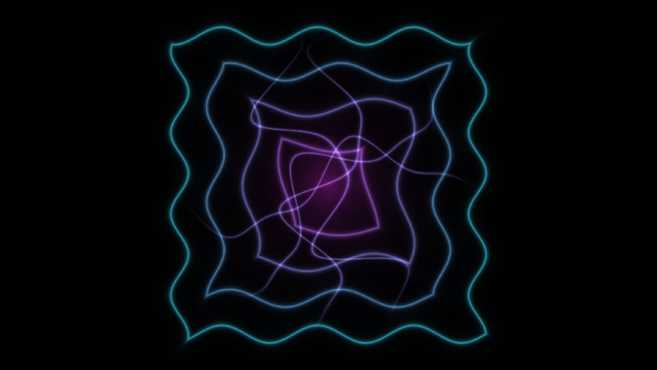

# Escena 83: Echoforms

Referencia: [*echoforms [audio-reactive touchdesigner tutorial 004]*](https://www.youtube.com/watch?v=_ohGu_afctg), de eclipsys //. El video combina ecos cuadrados, contornos distorsionados y un centro de trazos brillantes en magenta y cian.

Esta versión dibuja los ecos y filamentos en una pasada GLSL. La composición y la paleta están inspiradas en el tutorial; no reproduce exactamente su red de TOPs ni usa feedback de fotogramas. Esto evita que una textura de historial siga cambiando cuando el audio está en pausa.

Vista previa WebGL a 960×540 con las perillas a mitad de recorrido. `Detail 1–6` controla escala, grosor, cantidad de trazos, distorsión, mezcla de colores y halo. `Speed` mueve las deformaciones, `Density` agrega trazos y el kick ilumina el centro. Todo movimiento usa `uTime`, que se detiene en silencio. No hay zoom global.

Las 84 escenas caben en el dashboard de 1920×1080 con 11 columnas y ocho filas. La compilación GLSL y la vista previa WebGL están verificadas; los FPS reales deben medirse en TouchDesigner.
