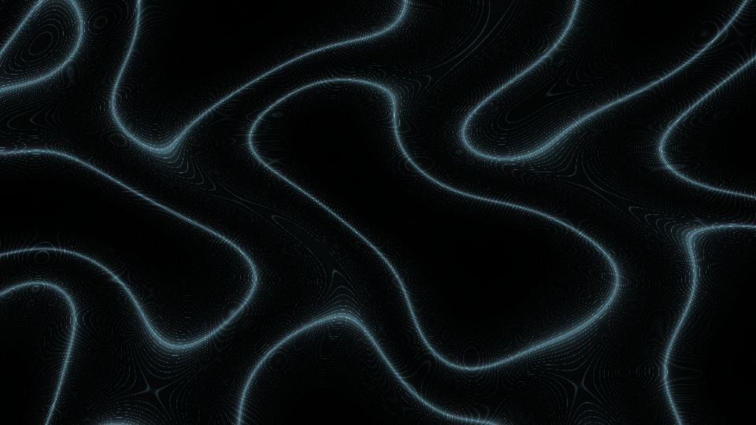

# Escena 84: Abstract Fluid

Referencia: [*Abstract Fluid Simulation — TouchDesigner Tutorial*](https://www.youtube.com/watch?v=e7K_UX7KUzw), de Daniel Steenhoff. El resultado combina grandes pliegues orgánicos oscuros con muchas líneas de contorno y bordes luminosos.

Esta adaptación dibuja un campo deformado y sus curvas de nivel en una sola pasada GLSL. La forma está inspirada en el video, pero no reproduce su simulación ni su red de feedback. Al no acumular fotogramas, el dibujo no sigue cambiando cuando se pausa la música.

Vista previa WebGL a 960×540 con las perillas a mitad de recorrido. `Detail 1–6` controla amplitud de pliegues, grosor de líneas finas, densidad de contornos, ancho del borde, mezcla azul y halo. `Speed` mueve el campo; `Density` aumenta los contornos y el kick ilumina los bordes. Todo movimiento usa `uTime`, que se detiene en silencio. No hay zoom global.

Las 85 escenas caben en el dashboard de 1920×1080 con 11 columnas y ocho filas. La compilación GLSL y la vista previa WebGL están verificadas; los FPS reales deben medirse en TouchDesigner.
