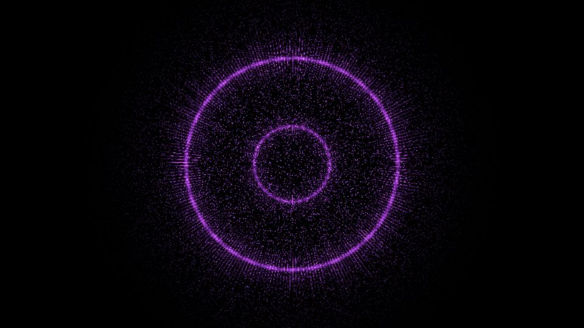

# Escena 85: Reactive Particles

Referencia: [*Reactive particles — TouchDesigner Tutorial*](https://www.youtube.com/watch?v=haeEIPgieLQ), de Pao Olea. La referencia usa partículas GPU y optical flow. Esta adaptación toma su aspecto de anillos violetas y nube de puntos; genera ambos en una sola pasada GLSL, sin simular partículas ni acumular fotogramas.

`Detail 1–6` controla separación de las coronas, largo de las puntas, cantidad de puntos, tamaño de puntos, mezcla violeta/magenta y halo. `Density` añade puntas y partículas; el kick ilumina y alarga las puntas sin cambiar el tamaño general. `Speed` gobierna el desplazamiento lento. Todo movimiento usa `uTime`, que se detiene sin música.

Las 86 escenas caben en el dashboard de 1920×1080 con 11 columnas y ocho filas. La vista previa WebGL está hecha a 960×540; los FPS reales deben medirse en TouchDesigner.
