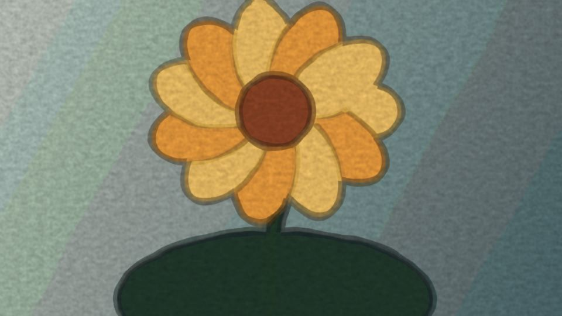

# Escena 86: Watercolor Media

Referencia: [*Turn Any Image into Watercolor Painting*](https://www.youtube.com/watch?v=9ynL-JckDkY), de PPPANIK. Esta versión usa la misma carpeta de imágenes y videos de las otras escenas Media. Aproxima el acabado de acuarela mediante lavado de color, contornos, pigmento irregular y textura de papel en una sola pasada GLSL.

La flor de la vista previa es una imagen sintética de prueba; no se incluye como material del set.

`Detail 1–6` controla suavidad del lavado, ondulación, contorno, simplificación del color, tinte Hue y grano. `Speed` mueve lentamente el pigmento mientras hay música; el kick ilumina levemente la pintura sin hacer zoom. Al no haber sonido, `uTime` se detiene y la transformación queda quieta. Si la fuente es un video, sus propios fotogramas pueden seguir cambiando.

Para usarla, pon fotos o videos en `/project1` → **Media** → **Carpeta de imagenes / GIFs**. La escena 86 comparte la imagen seleccionada y los modos de cambio con las otras escenas Media. Si la carpeta está vacía, se ve negro y el estado del dashboard indica que falta material.

La vista previa WebGL está hecha a 960×540. La compilación y los controles se verifican automáticamente; los FPS reales deben medirse en TouchDesigner.
