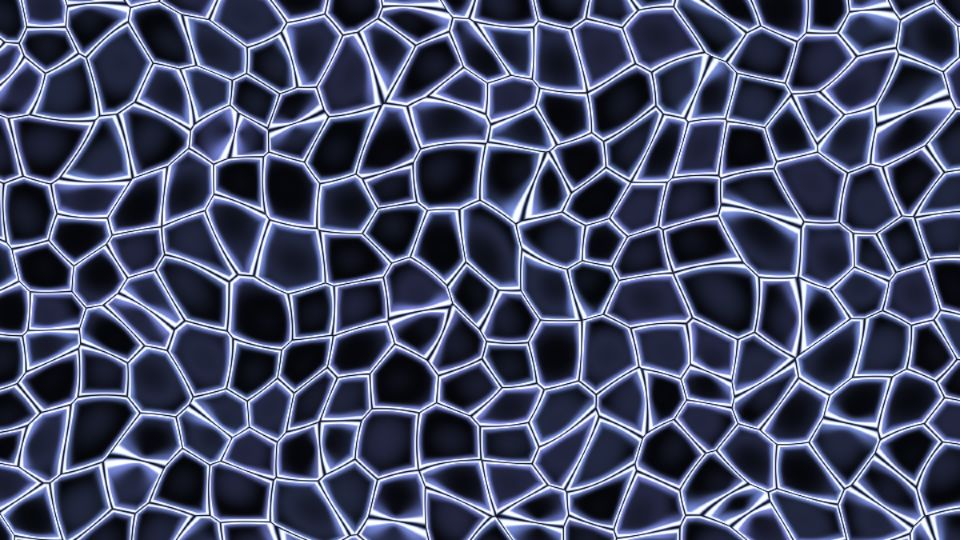

# Escena 87: Organic Structure

Referencia: [*Generative Organic Structure*](https://www.youtube.com/watch?v=cnIK7aGHf6o), de PPPANIK. El video crea una red orgánica similar a una telaraña y muestra versiones cromadas y superpuestas a foto o video. Esta escena adapta la versión cromada con celdas irregulares y reflejos violetas en una sola pasada GLSL.

`Detail 1–6` controla grosor, irregularidad, brillo especular, mezcla azul/violeta, oscuridad de las celdas y ancho del reflejo. `Density` cambia el número de celdas. `Speed` mueve lentamente los centros; el kick ilumina los bordes sin aplicar zoom. Todo movimiento propio usa `uTime`, que se detiene sin música.

La escena 87 completa las ocho filas actuales del dashboard (88 escenas, 11 columnas). La vista previa WebGL está hecha a 960×540; los FPS reales deben medirse en TouchDesigner.
