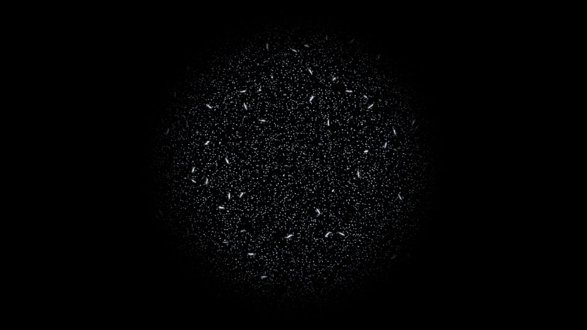

# Escena 88: Audio POPs

Referencia: [*Audio Reactivity with Basic POPs*](https://www.youtube.com/watch?v=XTIh2jwM_UY), de The Interactive & Immersive HQ. El tutorial construye una nube de partículas y trazos con POPs. Esta adaptación reproduce el aspecto de un cúmulo de puntos blancos y destellos lineales en una sola pasada GLSL, sin una simulación POP.

`Detail 1–6` controla tamaño y cantidad de puntos, largo y cantidad de trazos, matiz azul y halo. `Density` aumenta los puntos; el kick ilumina y alarga trazos locales, sin zoom global. `Speed` mueve lentamente la nube mediante `uTime`, que se detiene sin música.

La escena 88 inicia la novena fila del dashboard. Las miniaturas bajaron de 78 a 77 píxeles de alto para mantener visible Master FX en 1920×1080. La vista previa WebGL está hecha a 960×540; los FPS reales deben medirse en TouchDesigner.
