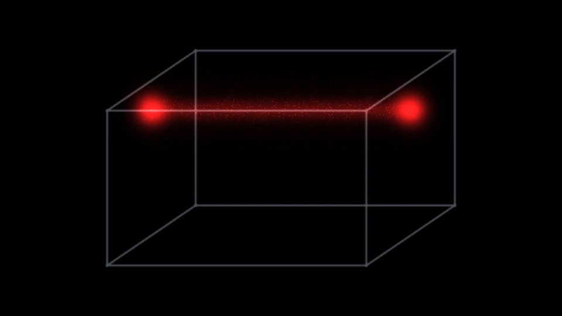

# Escena 89: Particle Cube Scanner

Referencia: [*Particle Cube Scanner — TouchDesigner POPs Tutorial*](https://www.youtube.com/watch?v=hviSCGjDO7Q), de Okamirufu Vizualizer. El tutorial usa POPs, ruido, límites y feedback para construir un cubo con un barrido rojo. Esta adaptación dibuja el cubo y la franja en una sola pasada GLSL.

`Detail 1–6` controla grosor de aristas, ancho del escáner, cantidad de partículas, irregularidad del barrido, mezcla rojo/naranja y halo de los extremos. `Speed` mueve el escáner; el kick ilumina la franja y el teclado puede señalar una altura. Todo movimiento propio usa `uTime`, que se detiene sin música. No hay zoom global.

La escena 89 ocupa la novena fila del dashboard. La vista previa WebGL está hecha a 960×540; los FPS reales deben medirse en TouchDesigner.
