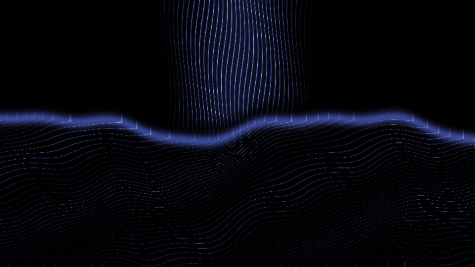

# Escena 90: The Shore

Referencia: [*TouchDesigner — The Shore Tutorial*](https://www.youtube.com/watch?v=bBbyMkzTNpg), de plyzitron. La escena une una caída de hebras azules con una superficie de olas de líneas finas. Esta adaptación usa campos analíticos en una sola pasada GLSL para evitar una gran red de TOPs.

`Detail 1–6` controla densidad de filamentos, altura de olas, irregularidad, ancho de la cascada, mezcla azul/blanco y halo. `Speed` mueve las ondas; el kick ilumina la espuma y altera un poco las olas sin aplicar zoom global. Todo movimiento usa `uTime`, que se detiene sin música.

La escena 90 está en la novena fila del dashboard. La vista previa WebGL está hecha a 960×540; los FPS reales deben medirse en TouchDesigner.
