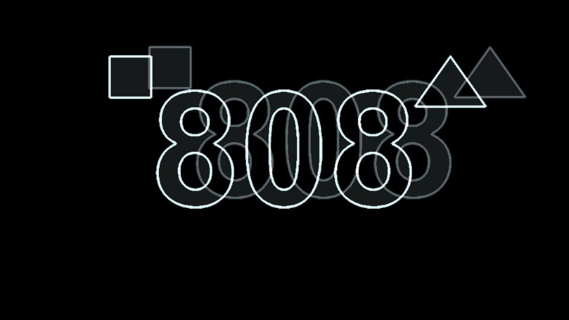

# Escena 91: Image Wire Extrusion

Referencia: [*Generate Shapes from an Image with TouchDesigner*](https://www.youtube.com/watch?v=98xNOgU1zeI), de Tender World. El tutorial procesa una imagen y extruye su geometría con SOPs. Esta adaptación dibuja sus bordes y una copia desplazada como una estructura de alambre en una sola pasada GLSL; no crea geometría 3D real.

La escena usa la imagen o video seleccionado en la carpeta **Media** de `/project1`. `Detail 1–6` controla sensibilidad de bordes, profundidad, dirección, brillo, tinte cian y caras laterales. `Speed` mueve levemente la profundidad; el kick la extiende un instante sin aplicar zoom. En silencio, `uTime` detiene la transformación. Si la fuente es un video, sus fotogramas pueden seguir avanzando.

La vista previa WebGL está hecha a 960×540 con una imagen geométrica sintética de prueba. Los FPS reales deben medirse en TouchDesigner.
