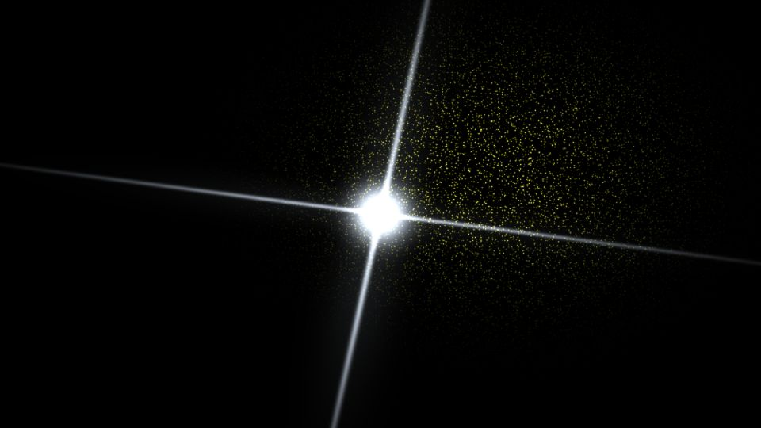

# Escena 92: Frequency Guided Particles

Referencia: [*Frequency Guided Particle Sim*](https://www.youtube.com/watch?v=A1TfrWmrOfA), de nicholaspjm. El tutorial combina posiciones de instancias con datos de frecuencias de audio. Esta adaptación conserva el núcleo brillante, los haces cruzados y una nube lateral de puntos en una sola pasada GLSL, sin simular partículas.

`Detail 1–6` controla inclinación de los haces, grosor del núcleo, cantidad y extensión de puntos, mezcla amarillo/verde y halo. Los graves iluminan los haces, los agudos iluminan la nube y el kick refuerza el núcleo. `Speed` desplaza levemente los puntos con `uTime`, que se detiene sin música. No hay zoom global.

La escena 92 está en la novena fila del dashboard. La vista previa WebGL está hecha a 960×540; los FPS reales deben medirse en TouchDesigner.
