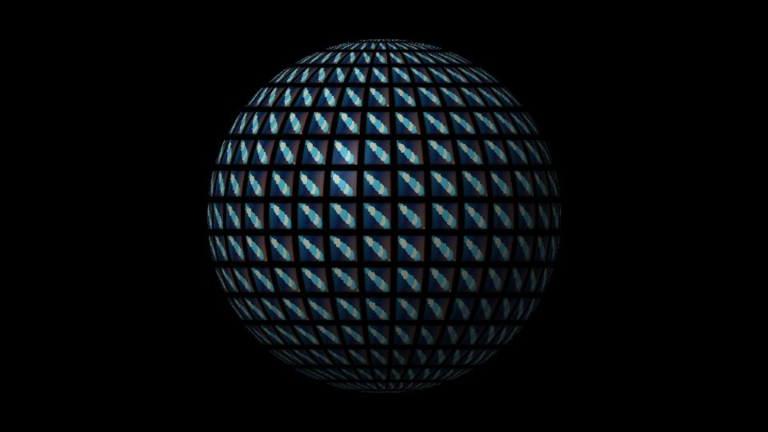

# Escena 93: Image Instancing Sphere

Referencia: [*Image Instancing Tutorial in TouchDesigner*](https://www.youtube.com/watch?v=O4uVBJKQzWk), de nicholaspjm. El tutorial instancia imágenes sobre una forma 3D. Esta adaptación usa un shader que proyecta la imagen seleccionada de **Media** sobre piezas de una esfera aparente. Repite y recorta una sola fuente a la vez; no carga muchas imágenes diferentes en paralelo.

`Detail 1–6` controla cantidad de piezas, separación, variación de recortes, velocidad relativa del giro, tinte azul y reflejo. `Density` añade piezas; el kick ilumina solo algunas, sin hacer zoom. El giro usa `uTime`, que se detiene sin música. Si la fuente es un video, sus fotogramas pueden seguir avanzando.

La vista previa WebGL está hecha a 960×540 con una imagen de prueba sintética. Los FPS reales deben medirse en TouchDesigner.
