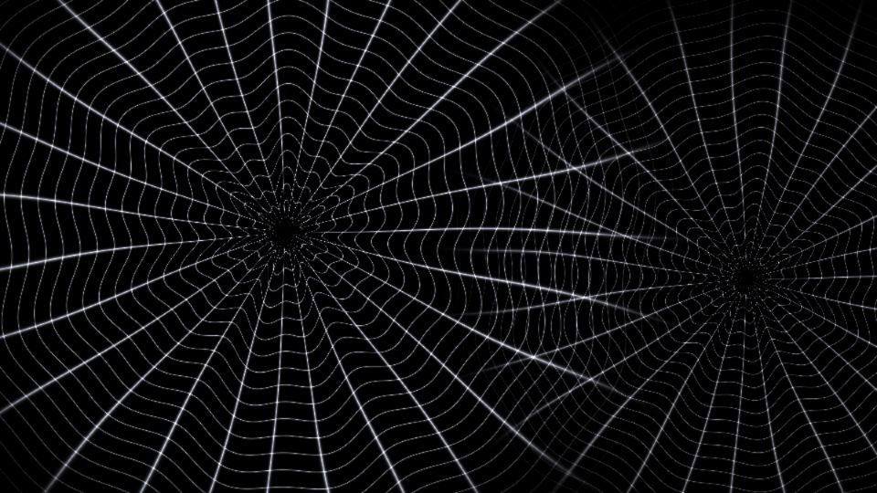

# Escena 94: Procedural Spiderweb

Referencia: [*Procedural Audioreactive Spiderweb*](https://www.youtube.com/watch?v=dPSB9sudk7Q), de PPPANIK. Esta adaptación dibuja dos tramas radiales con hilos irregulares y cruces luminosos en una sola pasada GLSL. Es distinta de la escena Red, que une nodos dispersos, y de Organic Structure, que dibuja celdas cromadas.

`Detail 1–6` controla número de radios y anillos, grosor, irregularidad, tinte violeta y halo. `Speed` deforma los hilos lentamente; el kick ilumina los cruces y altera solo un poco la trama. Todo movimiento usa `uTime`, que se detiene sin música. No hay zoom global.

La vista previa WebGL está hecha a 960×540; los FPS reales deben medirse en TouchDesigner.
