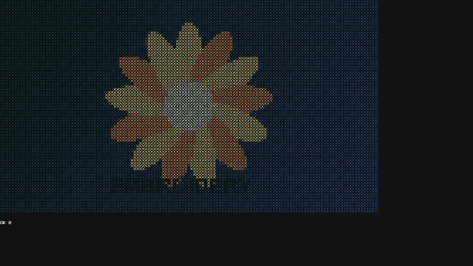

# Escena 95: Digital Embroidery

Referencia: [*Digital Embroidery FX*](https://www.youtube.com/watch?v=Xcdl-16MI8Y), de Xtal. Esta adaptación toma la imagen o video seleccionado en **Media** y dibuja una cruz de hilo por celda, con color tomado de la fuente y una tela oscura detrás. Usa una sola pasada GLSL.

`Detail 1–6` controla cantidad y grosor de puntadas, inclinación, intensidad del color original, color de la tela y relieve del hilo. `Density` añade puntadas; el kick ilumina algunas celdas sin aplicar zoom. El movimiento propio usa `uTime`, que se detiene sin música. Si la fuente es un video, sus fotogramas pueden seguir avanzando.

La vista previa WebGL está hecha a 960×540 con una imagen sintética de prueba. Los FPS reales deben medirse en TouchDesigner.
