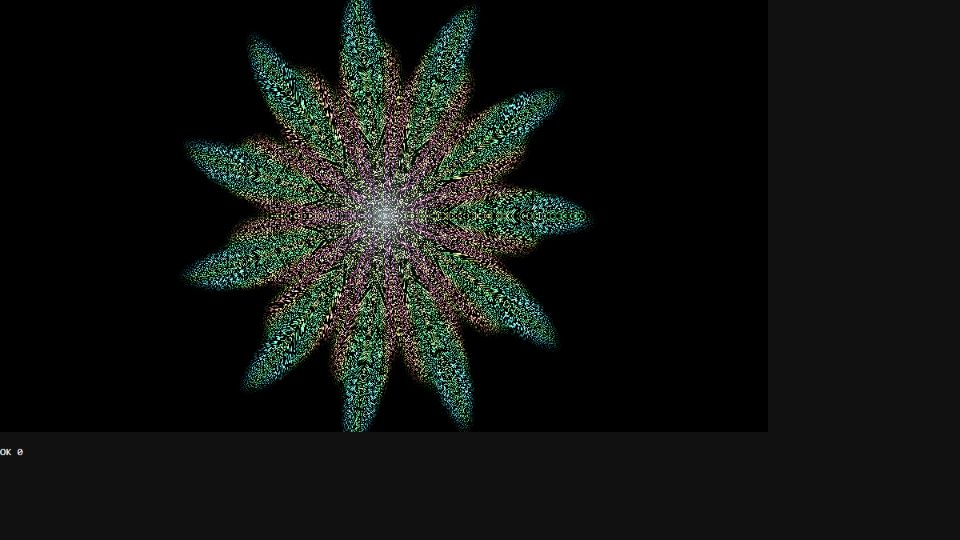

# Escena 96: Particle Mandala

Referencia: [*Symmetrical Mandala Pattern inspired by Sacred Geometry Using SOP Instancing*](https://www.youtube.com/watch?v=oSvO30HW12k), de Okamirufu Vizualizer. Esta adaptación dibuja puntos en sectores espejados que forman pétalos radiales y pliegues. Usa una sola pasada GLSL, sin instancias SOP ni red adicional de TOPs.

`Detail 1–6` controla densidad de puntos, sectores de simetría, pliegues, tamaño de los puntos, mezcla cromática y brillo del núcleo. El kick ilumina algunas partes sin aplicar zoom. El movimiento usa `uTime`, que se detiene sin música.

La vista previa WebGL está hecha a 960×540 con controles de prueba. Los FPS reales deben medirse en TouchDesigner.
