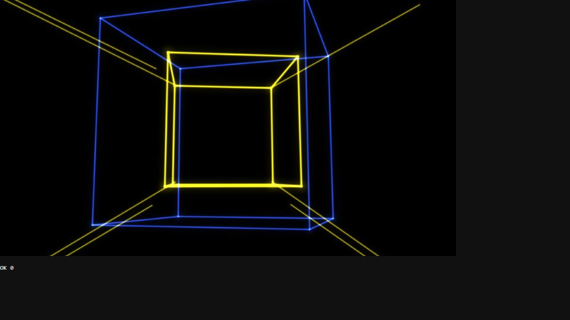

# Escena 97: Audio Wire Room

Referencia: [*Audio Reactivo – TouchDesigner Tutorial*](https://www.youtube.com/watch?v=yWvpRXY0Kyc), de Pao Olea. Esta adaptación dibuja cubos de líneas amarillas y azules y haces en perspectiva con una pasada GLSL. Aprovecha los canales de audio ya calculados por el rig.

`Detail 1–6` controla grosor, profundidad, respuesta del giro al kick, cantidad de haces, mezcla azul y halo. El kick gira brevemente el cubo y acentúa las aristas; los bajos y agudos refuerzan la luz. El reloj `uTime` se detiene sin música. No hay zoom automático.

La vista previa WebGL está hecha a 960×540 con valores de audio de prueba. Los FPS reales deben medirse en TouchDesigner.
