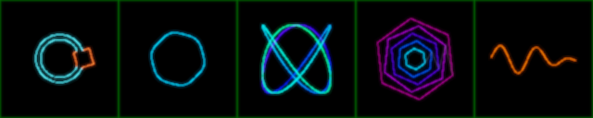

# Láser ILDA opcional

El láser es un módulo que se enciende y se apaga. **No siempre hay láser**, así que por defecto está **APAGADO**. En ese estado `/project1/laser` no se calcula y el rig funciona exactamente igual que sin este módulo.



*Simulador: AUTO (trazado de la escena), CÍRCULO, LISSAJOUS, TÚNEL y ONDA. Se genera con `td/tools/preview_laser.py`, sin TouchDesigner y sin hardware.*

## Los tres modos

`/project1` → pestaña **Laser** → **Modo laser**

| Modo | Qué hace | Hardware |
|---|---|---|
| **0 · APAGADO** | Nada. El COMP `laser` no se calcula y no cuesta nada. Es el valor por defecto | — |
| **1 · SIMULADOR** | Calcula el frame láser y lo dibuja como se vería el haz. Pulso **Abrir simulador** | Ninguno |
| **2 · SALIDA DAC** | Además lo manda al DAC, pero **solo** si **ARMAR emisión** está prendido y no hay Blackout | DAC + láser |

Cuando el build de TouchDesigner no trae ningún CHOP de DAC, el modo SALIDA se queda en simulador y el panel de diagnóstico lo muestra con `SIN DAC -> solo simulador`. El build no se detiene por eso.

## Seguridad: qué se desarma solo

**ARMAR emisión** se apaga en estos casos:

- al arrancar el proyecto, aunque se haya guardado prendido,
- con **PÁNICO**,
- al salir del modo SALIDA DAC.

Hay dos candados. Sin armar, `laser_points` manda el recorrido con **todos los colores en 0**, y además el parámetro de activación del DAC depende de `Lasermode == 2 and Laserarm and not Blackout`.

Estas reglas se aplican siempre, también en el simulador. Así lo que ves en el simulador es lo que saldría por el láser:

| Regla | Parámetro |
|---|---|
| Blackout y Master Fade apagan o atenúan el láser igual que el video | (los del show) |
| Techo de brillo | **Brillo máximo** (por defecto 0.5) |
| Zona permitida: lo que cae fuera se **apaga**, no se dibuja sobre el borde | **Zona: izquierda/derecha/abajo/arriba** |
| Presupuesto de puntos por frame: si se pasa, se aligera la figura | **Puntos máximos por frame** (800) |
| Saltos entre figuras con el haz apagado (blanking) | automático |

> ⚠️ Antes de usar SALIDA DAC con público, ajusta la **zona** para que el haz nunca apunte a la gente. Además necesitas un E-stop físico y revisar las normas del lugar. El software ayuda, pero no reemplaza eso.

## Patrones

**Patrón** en la pestaña Laser:

- **AUTO**: traza los bordes de lo que está al aire (`show_out` reducido a 96×54). Funciona con las 98 escenas sin tocarlas. Se ve mejor en escenas de líneas (spiderweb, wire room, polar trails); en escenas de relleno o ruido sale una figura más cargada. **AUTO: umbral** decide qué tan brillante debe ser algo para trazarlo.
- **CÍRCULO, LISSAJOUS, TÚNEL, ONDA**: figuras vectoriales limpias. Leen los mismos canales que las escenas: Hue, Density, Chaos, bajo, kick y beat.

## Probar sin láser

1. **Dentro de TD**: pon Modo laser = 1 y pulsa **Abrir simulador**. En gris tenue se ven los saltos apagados y en verde el recuadro de la zona. El panel de diagnóstico muestra `LASER: SIMULADOR | N pts (M encendidos)`.
2. **Archivo .ild**: el pulso **Exportar .ild (5 s)** graba 5 segundos en `td/config/laser_FECHA.ild`. Ese archivo se abre en cualquier visor o programa láser (QuickShow, Beyond, LaserOS o visores ILDA libres). Si ahí se ve bien, se verá bien en el proyector.
3. **Fuera de TD**:

   ```bash
   python3 td/tools/preview_laser.py salida/            # un PNG por patrón
   python3 td/tools/preview_laser.py salida/ --ild      # + .ild animado de 2 s
   python3 td/tools/preview_laser.py salida/ --img captura.png   # AUTO sobre tu imagen
   python3 td/tools/test_laser.py                       # reglas de seguridad y formato
   ```

## Cómo está armado

```
/project1/laser   (COMP: allowCooking = Modo laser != APAGADO)
  show_out ─> laser_down (96×54) ─┐
  /project1/ctrl ────────────────> laser_points (Script CHOP: x y r g b) ─> laser_dac
  ctrl_tex ─> laser_preview (Script TOP) <─ último frame ─┘
                   └─> laser_window (ventana del simulador)
```

- `vjcore/laserfx.py`: patrones, trazado, seguridad, simulador y escritor/lector `.ild`. Es Python puro y está probado fuera de TD.
- `vjcore/laser.py`: la red dentro de TD, habilitar/deshabilitar y línea de estado.

## No verificado (no hay TD ni láser en el entorno donde se escribió)

| Qué | Qué se prueba | Si falla |
|---|---|---|
| Tipo de CHOP de DAC | `laserdeviceCHOP`, `heliosdacCHOP`, `etherdreamCHOP`, en ese orden | Queda en simulador y se avisa en el log |
| Parámetro de activación del DAC | `active`, `enable`, `output` | Se avisa; la emisión igual queda protegida por los colores en 0 |
| Puntos por segundo | `pointrate`, `pps`, `samplerate`, `rate` = 30000 | Ajustarlo a mano en `laser_dac` |
| Nombres de canal que espera el DAC | se mandan `x y r g b` | Poner un Rename CHOP entre `laser_points` y `laser_dac` |
| Script CHOP/TOP | `callbacks`, `numpyArray()`, `copyNumpyArray()` | Error en la Textport, dentro de `/project1/laser` |

Cuando llegue el DAC: Modo laser = 2, revisa los avisos `LASER` del build en la Textport, ajusta zona, tamaño y brillo con el haz a baja potencia, y solo entonces **ARMAR**.
